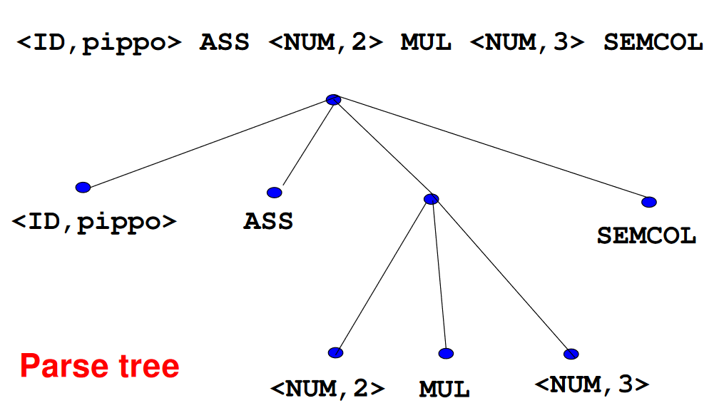
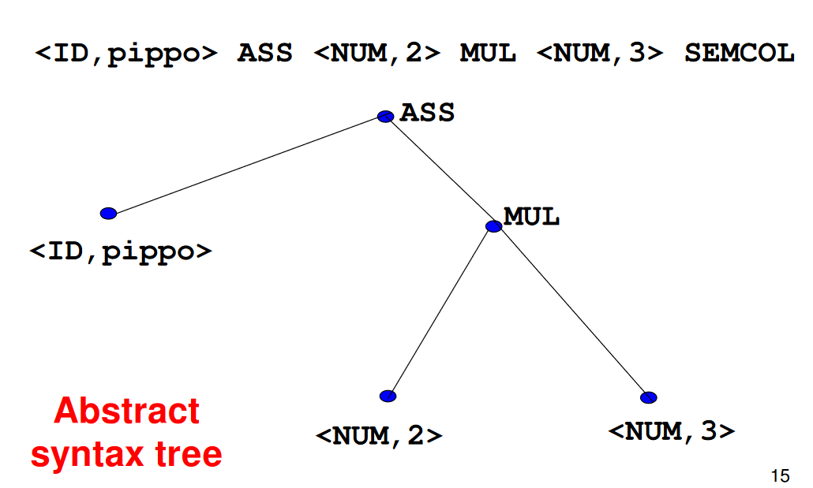

## A long way to go
Vedremo solo la conversione fino al codice intermedio ma non oltre.
Per poter eseguire il codice sorgenete sarebbero necessari ulteriori passaggi come la conversione in istruzioni binarie ed il linking delle librerie.
## Una lunga pipeline
Il programmma è scritto in un linguaggio che aderisce ad una specifica grammatica.
Alcuni codici sorgenti sono sintattucamente legali, mentre altri no, la grammatica serve proprio a decidere su questo.
* **Analisi lessicale:** traduce un flusso di caratteri in un flusso di *token*.
	E.g. possiamo tradure  `pippo = 2 * 3` in `<ID,pippo> ASS <NUM,2> MUL <NUM,3> SEMCOL`
* **Analisi sintattica:** controlla se il flusso di *token* aderisce o meno alla grammatica.
  In caso affermativo lo stream viene convertito in un *parse tree* o ancora meglio in un *abstract syntax tree*.
	E.g.  
* **Analisi semantica:** dato un *syntax tree* e le informazioni della *symbol table* controlla la consistenza del codice.
	E.g. *type checking* oppure conversione di tipi detta *coercions*.
* **Generazione di codice intermedio:** converte il *parse tree* in un codice testuale intermedio.
* **Generazione del codice target:** traduce il codice intermedio nel vero e proprio codice macchina (assembly).
## Possibili target
Il codice macchina non è per forza l'obbiettivo della compilazione, potremmo avere anche:
* Una macchina virtuale come la [JVM](https://en.wikipedia.org/wiki/Java_virtual_machine).
* Oppure la traduzione in un altro linguaggio con un [transpiler](https://en.wikipedia.org/wiki/Source-to-source_compiler).
## Front-end & Back-end
### Front-end
Si occupa di tutta la parte dall'*analisi lessicale* fino alla *generazione di codice intermedio*, questa parte sarà l'argomento di tutto il corso.
### Back-end
Tutta la restante parte dei compilatori.
### Vantaggi
La parte di *front-end* è dipendente dal linguaggio, poniamo di avere *N* linguaggi.
La parte di *back-end* e dipendente dall'architettura della macchina, supponiamo di avere *K* architetture diverse.
Grazie alla divisione in *back-end* e *front-end* possiamo avere *N\*K*  compilatori.