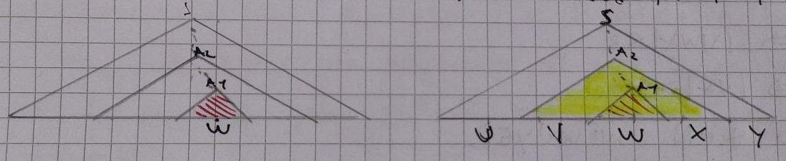
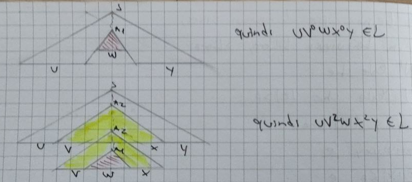
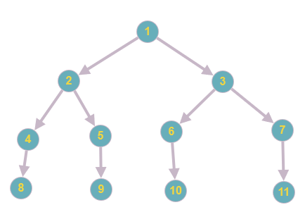

## Chiusura rispetto all'unione
### Lemma
La classe dei linguaggi liberi è chiusa rispetto all'unione insiemistica $\cup$, quindi se $L_1$ e $L_2$ sono due linguaggi liberi allora $L_1 \cup L_2$ è in linguagio libero.
### Dimostrazione
Pongo $L_1$ e $L_2$ due linguaggi liberie le loro grammatiche $G_1=(V_1, T_1, S_1, P_1)$ e $G_2=(V_2, T_2, S_2, P_2)$.  
Poniamo allora $V^\prime_2$ il *name refreshing* di $V_2$ per evitare nomi uguali nei non terminali di $V_1$.  
Possiamo allora costruire: $$G_3=(V_1 \cup V^\prime_2 \cup \{S\}, T_1 \cup T_2, S, P_1 \cup P^\prime_2 \cup \{S \to S_1|S^\prime_2\})$$
dove:
* $S$ è un nuovo simbolo non in $V_1 \cup V^\prime_2$.
* $S^\prime_2$ è il refresh di $S_2$.
* $P^\prime_2$ è il refresh delle produzioni di $P_2$.
Allora $L(G_3)$ è un linguaggio libero e $L(G_3) = L(G_1) \cup L(G_2)$.  

Però perchè $G_3$ è libero?  
Prendiamo le produzioni di $G_3 \in \{ P_1 \cup P^\prime_2 \cup \{S \to S_1 | S^\prime_2\}\}$, allora quelle in $P_1$ e $P^\prime_2$ hanno la stessa forma che avevano prima del refreshing dei nomi, $A \to \alpha$.  
Di coneguenza le produzioni $S_3 \to S_1$ e $S_3\to S^\prime_2$ hanno la forma $A \to \alpha$.

Ci rimane da dimostrare perchè $L(G_3) = L(G_1) \cup L(G_2)$?
Poniamo $w \in L(G_3)$ che può esistere se e solo se $S \implies w$ oppure:
$$S \implies S_1 \implies^* w \hspace{3em} \text{oppure} \hspace{3em} S \implies S^\prime_2 \implies^* w$$
Quindi $$w \in L(G_1) \hspace{3em} \text{oppure} \hspace{3em} w \in L(G_2)$$
Posso quindi concludere dicendo che:
$$w \in L(G_1) \cup L(G_2)$$
### Esempio
$$G_1: \begin{cases} S_1 \to aA \\ A \to a \end{cases}$$
$$G_2: \begin{cases} S_2 \to bA \\ A \to b \end{cases}$$
Allora $L(G_1)=\{aa\}$ e $L(G_2)=\{bb\}$.
Facendo il *name refresh* di $G_2$, $A$ diventa $A^\prime$, posso quindi creare l'unione delle grammatiche. 
$$G_3: \begin{cases} S \to S_1|S_2\\ S_1 \to aA\\ S_2 \to bA^\prime\\ A \to a\\ A^\prime \to b \end{cases}$$
Possiamo ora vedere che $L(G_3) = \{aa,\ bb\} = \{aa\} \cup \{bb\} = L(G_1) \cup L(G_2)$ .
## Chiusura rispetto alla concatenazione
### Lemma
La classe dei linguaggi liberi è chiusa rispetto alla concatenazione, quindi se $L_1$ e $L_2$ sono linguaggi liberi allora $\{w_1 w_2 | w_1 \in L_1 \land w_2 \in L_2\}$ è un linguaggio libero.
### Dimostrazione
Siano $L_1$ e $L_2$ due linguaggi liberi, allora esistono due grammatiche $G_1 = (V_1, T_1, S_1, P_1)$ e $G_2 = (V_2, T_2, S_2, P_2)$ tali che $L_1 = L(G_1)$ e $L_2 = (G_2)$.
Senza perdere generalità possiamo affermare che non ci siano *name clash* tra i non terminali di $G_1$ e quelli di $G_2$, se fosse necessario possiamo comunque fare un *name refresh*.
Sia allora $G_3 = (V_1 \cup V_2 \cup \{S\}, T_1 \cup T_2, S, P_1 \cup P_2 \cup \{ S \to S_1 S_2 \})$ con $S$ un nuovo simbolo non in $V_1 \cup V_2$.
Allora $L(G_3)$ è libero $L(G_3) = \{w_1 w_2\ |\ w_1 \in L(G_1) \land w_2 \in L(G_2)\}$.
## Chomsky Normal Form
Una grammatica $G$ è in Chomsky Normal Form se e solo se:
* Non possiede $\varepsilon$-produzioni, al massimo $S \to \varepsilon$
* Tutte le altre produzioni hanno le forme:
	* $A \to a$
	* $A \to BC$
		in cui $B$ e $C$ sono diversi da $S$.
## Pulire grammatiche libere
### Teorema
Sia $L$ un linguaggio *contex-free*, allora esiste una gramatica *context-free* tale che $L(G) = L \backslash \{  \varepsilon \}$ e che rispetta le seguenti regole:
* Non esitono $\varepsilon$-produzioni quindi produzioni con la forma $A \to \varepsilon$.
* Non esistono produzioni d'unità $A \to B$.
* Non esistono non-terminali "inutili" ovvero non-terminali che non appaiono mai in alcune stringhe terminali.
#### Nota
Ogni produzione $A \to \beta$ in $G$ è tale che o $\beta$ è un singolo terminale oppure $|\beta| \geq 2$.
### Eliminazione delle $\varepsilon$-produzioni
* Trovare tutti i non-terminali *nullable*, ovvero tali che $A \implies^* \varepsilon$
	* **Base:** se $A \to \varepsilon$ è una produzione, allora $A$ è *nullable*.
	* **Iterazione:** se $A \to Y_1 Y_2 \dots Y_n$ è una produzione e $Y_1 Y_2 \dots Y_n$ è *nullable* allor anche A lo è.
* Sostituire ogni produzione $A \to Y_1 Y_2 \dots Y_n$ con una serie di produzioni dove le combinazioni *nullable* di $Y_i$ sono rimosse dal body della produzione.
* Eliminare le produzioni $A \to \varepsilon$.
#### Esempio
$S \to ABC | abc$
$A \to aB | \varepsilon$
$B \to bA | C$
$C \to \varepsilon$

Ora eseguo i passaggi per eliminare tutte le $\varepsilon$-produzioni:
* $A$ e $C$ sono annullabili per $A \to \varepsilon$ e $C \to \varepsilon$
* $B$ è *nullable* per $B \to C$ visto che $C$ è *nullable*
* $S$ è *nullable* perchè in $S \to ABC$ A, B e C sono *nullable*

La grammatica così diventa:
$S \to abc | AB | A | B$
$A \to aB$
$B \to bA$
## Pumping lemma per cfl
### Lemma
Sia $L$ un linguaggio libero, allora:
* $\exists p \in \mathbb{N}^+$
* $\forall z \in L$ tale che $|z| > p$
* $\exists u, v, w, x, y$ tali che:
	* $z = uvwxy \ \land$
	* $|vwx| \leq p \ \land$
	* $|vx| > 0 \ \land$
	* $\forall i \in \mathbb{N} \ | \ uv^iwx^iy \in L$
### Dimostrazione
Sia $L$ un linguaggio libero, il lemma vale per $p > 0$ e quindi per parole diverse da $\varepsilon$.
Consideriamo ora la grammatica nella forma normale di Chomsky $G$ tale che $L = L(G)$.
Così facendo nell'albero di derivazione ogni percorso dalla radice alle foglie attraversa tanti non-terminali quanti salti fa.
Poniamo $p$ come la lunghezza della parola più lunga ottenibile dall'albero di derivazione che ha come altezza il numero di caratteri non-terminali della grammatica. 
Poniamo quindi $z \in L$ tale che $|z| > p$, allora esiste un albero di derivazione per $z$ la cui altezza è strettamente maggiore del numero di non terminali.
Consideriamo ora il percoso più lungo da radice a foglie e la coppia dello stesso non terminale più in profondità lungo il percorso.
Con profondità della coppia intendiamo la profondità della seconda occorenza anadndo *bottom-up*.
Chiamiamo $A_1$ e $A_2$ la coppia di un terminale A, allora esieteranno due diversi sotto-alberi (ricordiamo che $z = uvwxy$).

Vedremo ora, graficamente, che $uv^0wx^0y \in L$ e $uv^1wx^1y \in L$, quindi $\forall i \in \mathbb{N} \ | \ uv^iwx^iy \in L$.

Allora $\forall i \in \mathbb{N} \ | \ uv^iwx^iy \in L$, con $|vwx| \leq p$.
Dalla scelta della tupla $(A_1, A_2)$ l'altezza del sotto-albero con radice $A_2$ è minore rispetto al numero di non-terminali, quindi la lunghezza è limitata superiormente da $p$.
$|vx| > 0$ è dato dal fatto che la grammatica $G$ è nella forma "ripulita" e se $A \implies^* \alpha A \beta$ allora almeno uno dei due simboli ($\alpha, \beta$) deve fornirne uno ulteriore.
### Applicazioni pumping lemma
Questo lemma viene usato per dimostrare che un linguaggio $L$ **NON** è libero.
Lo schema per la dimiostraione è il seguebte:
* Assumiamo che il linguaggio $L$ sia libero.
* Dimostriamo che $L$ infrange la tesi del lemma, quindi $\exists i \in \mathbb{N} \ | \ uv^iwx^iy \notin L$.
* Dimostriamo per contradizione che $L$ non è libero.
A livello operazionale si procede per step nella dimostrazione:
1. Scegliamo un qualsiasi numero naturale $p$.
2. Scegliamo una parola $z$ più lunga di $p$ e che appartenga al linguaggio.
3. Spacchettiamo ora $z$ in $uvwxy$ in modo tale che $|vwx| \leq p \land |vx| > 0$.
4. Ora dobbiamo trovare un intero $i$ tale che $uv^iwx^iy \notin L$.
### Esempio 1
Data la grammatica $G$ dobbiamo dimostrare che non è *context-free*.
$$G: \begin{cases} S \to aSBc\ |\ abc\\ cB \to Bc\\ bB \to bb\end{cases}$$
Il linguaggio generato è $L(G) = \{a^n b^n c^n \ | \ n > 0\}$, supponiamolo libero.
Sia $p$ un intero positivo scelto in modo arbitrario, allora $z = a^p b^p c^p$.
Per rispettare le condizioni del lemma vediamo $z$ come $z=uvwxy$ con $|vwx| \leq p \land |vx| > 0$.
Però notiamo che $vx$ non può contenere sia $a$ che $c$ perchè l'ultima occorenza di $a$ e la prima di $c$ sono ad una distanza $p+1$, quindi per $k,j \in \mathbb{N}^+$:
$$vwx = a^k \ | \ a^k b^j \ | \ b^j \ | \ b^j c^k \ | \ c^k$$
Concludiamo che $vwx$ non ha occorenze di $a$ oppure non ha occorenze di $c$, per cui $uv^0wx^0y$ non può avere la forma $a^n b^n c^n$ quindi $uv^0wx^0y \notin L$.
Per contradizione, grazie al pumping lemma, abbiamo dimostrato che $L$ non è libero.
### Esempio 2
Data la grammatica $G$ dobbiamo dimostrare che non è *context-free*.
$$G: \begin{cases}
	S \to CD\\
	C \to aCA \ | \ bCB \ | \ \varepsilon\\
	AD \to aD\\
	BD \to bD\\
	Aa \to aA\\
	Ab \to bA\\
	Ba \to aB\\
	Bb \to bB\\
	D \to \varepsilon
\end{cases}$$
Dobbiamo per prima cosa trovare il linguaggio generato $L$ (dioca 💀).
Dobbiamo aguzzare la vista e notare alcune particolarità.
$D$ va solo in $\varepsilon$ quindi la stringa può crescere solo verso la $C$.
Il delimitatore $D$ che fa sviluppare i non-terminali alla sua sinistra.
Quando un terminale $a$ o $b$ è a destra del non-terminale $B$ possiamo scambiare le posizioni di essi.
Tramite un po' di prove troviamo $L = \{ ww\ | \ w \in \{a,b\}^* \}$
Quindi è libero o meno?
Una buona scelta è prendere $z = a^p b^p a^p b^p$, per cui se decomponiamo $a^p = u,\ b^p=vwx,\ a^pb^p=y$ questa rispetta $|vwx| \leq p$.
Ora poniamo l'indice $i = 0$ per cui la parola diventa $w_1 = a^p b^{p-x} a^p b^p$ , con $x$ la quantità mancante per via dell'indice.
Possiamo vedere che $w_1 \notin L$ per cui $L$ non è un linguaggio libero.
### Esempi noti
* $\{a^n b^n c^n \ | \ n > 0\}$ non è libero
* $\{a^n b^n c^j \ | \ n,j > 0\}$ è libero, concatenazione di due linguaggi $\{a^n b^n \ | \ n > 0\}$ e $\{c^j \ | \ j > 0\}$
* $\{a^j b^n c^n \ | \ j,n > 0\}$ è libero, concatenazione di due linguaggi $\{a^j \ | \ j > 0\}$ e $\{b^n c^n \ | \ n > 0\}$
## Pumping lemma per cfl variant
### Note iniziali
Trasformiamo una grammatica $G^\prime$ in una grammatica in *Chomsky normal form* $G$, quindi avrà la forma.
$$G: \begin{cases} A \to a\\  A \to A_1 A_2 \\ \vdots \end{cases}$$
### Dimostrazione
Sia $k$ il numero di non terminali in $G$ e che essendo in *Chomsky nomrla form* l'albero di derivazione di $L(G)$ sarà sempre un albero binario del tipo:

Pongo allora $p = 2^{k+1}$ e $z \in L$ tale che $|z| \geq p$, allora l'albero di derivazione di $z$ avrà almeno $k+2$ livelli.
Il percorso più lungo attraversa $k+1$ non terminali, quindi c'è almeno una coppia lungo il percorso.
Da qui si prosegue come nella dimostrazione del pumping lemma per cfl "normale".
## Chiusura rispetto all'intersezione
### Lemma
La classe dei linguaggi liberi non è chiusa rispetto all'intersezione.
### Dimostrazione
Per dimostrare la non chiusura basta trovare un esempio che la viola, eseguiamo questa dimostrazione in modo "empirico".
Prendiamo due linguaggi liberi:
$$L_1=\{a^n b^n c^j \ | \ n,j > 0 \}$$
$$L_2 = \{ a^j b^n c^n \ | \ n,j > 0\}$$
La loro intersezione sarà $L_3 = L_1 \cap L_2$:
$$L_3 = \{ a^n b^n c^n \ | \ n > 0 \}$$
Rifacendoci agli esempi noti visti in precedenza sappiamo che questo linguaggio non è libero, abbiamo quindi trovato un contro esempio per la chiusura rispetto all'interseione.