## Riconoscere i linguaggi
Prendiamo l'esempio di $L = \{ a^n b^n \ | \ n > 0 \}$, una buona scelta è usare uno stack, prima inserisco tutte le $a$, poi faccio una `pop` per ogni $b$ che leggo, se alla fine lo stack è vuoto allora la parole appartiene al linguaggio.
Però con dei linguaggi più complessi non ho scelta e devo usare una macchina a stati.

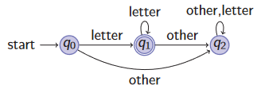
## Linguaggi regolari
Le grammatiche regolari sono grammatiche libere che hanno solo produzioni della forma:
* $A \to a$
* $A \to aB$
* $A \to \varepsilon$
Questi linguaggi generato delle espressioni regolari, vengono riconosciuti attraverso l'uso di automi deterministici e non.
Per la loro facilità di analisi sono alla base dell'analisi lessicale.
### Espressioni regolari (regex)
Fissiamo un alfabeto $\mathcal{A}$  e un certo numero di operatori.
Definiamo allora le espressioni regolari in modo induttivo:
* **Caso base:**
	* $\forall a \in \mathcal{A}$ è una regex
	* $\varepsilon$ è una regex
* **Passo induttivo:** se $r_1$ e $r_2$ sono espressioni regolari allora:
	* $r_1 \ | \ r_2$ è una regex detta *alternanza*
	* $r_1 \cdot r_2$ oppure $r_1r_2$ , è una regex chiamata *concatenazione*
	* $r_1^*$ è una regex chiamata *Kleene star* e significa ripetere 0 o più volte il simbolo $r_1$
	* $(r_1)$ è una regex detta *parentesi*, si usa per esprimere la precedenza
### Linguaggi denotati
Se un linguaggio può essere denotato da unìespressione regolare possiamo dire che la regex *denota* quel linguaggio.
Consideriamo un'espressione regolare $r$ su $\mathcal{A}$, il linguaggio denotato da quell'espressione $L(r)$ è definibile tramite induzione.
* **Caso base:**
	* $L(a) = \{a\} \ \forall a \in \mathcal{A}$
	* $L(\varepsilon) = \{ \varepsilon \}$
* **Passo induttivo:**
	* Se $r = r_1 \ | \ r_2$ allora $L(r) = L(r_1) \cup L(r_2)$
	* Se $r = r_1r_2$ allora $L(r) = \{ w_1w_2 \ | \ w_1 \in L(r_1) \land w_2 \in L(r_2) \}$
	* Se $r = r^*_1$ allora $L(r) = \{ \varepsilon \} \cup \{ w_1 w_2 \dots w_k \ | \ k\ \geq 1 \land \forall i : 1 \leq i \leq k.w_i \in L(r_1)\}$
	* Se $r = (r_1)$ allora $L(r) = L(r_1)$
Come nell'aritmetica anche qua i vari operatori hanno delle precedenze:
1. Kleene star
2. Concatenazione
3. Alternanza
Tutte le operazioni sono associative a sinistra.
#### Esempi di linguaggi denotati
* $L(a|b) = \{a,b\}$
* $L((a|b)(a|b)) = \{aa, ab, ba, bb\}$
* $L(a^*) = \{ a^n | n \geq 0 \}$
* $L(a|a^*b) = \{ a \} \cup \{ a^n b | n \geq 0 \}$
## Automi a stati finiti
Sono usati per determinare se una parola appartiene ad un linguaggio denotato da una certa espressione regolare.
Vedremo due tipi di automi:
1. Nondeterministc Finite state Automata (NFA)
2. Deterministic Finite state Automata (DFA)
Solitamente i calcoli negli NFA risultano molto più pesanti perchè si devono percorrere molti più cammini di derivazione rispetto ad un DFA.
## Nondeterministc Finite state Automata (NFA)
un automa a stati finiti non deterministico è rappresentato dalla tupla:
$$\mathcal{N} = (S,\mathcal{A},\text{move}_n, s_0, F)$$
nella quale:
* $S$ è l'insieme degli stati
* $\mathcal{A}$ è il vocabolario con $\varepsilon \notin \mathcal{A}$
* $s_0 \in S$ è lo stato iniziale
* $F \subseteq S$ è l'insieme degli stati finali o accettati
* move$_n$ : $S \times (\mathcal{A} \cup \{ \varepsilon \}) \to 2^S$ la funzione di transizione, che associa una tupla <stato,carattere> ad un elemento dell'insieme potenza di $S$. 
### Rappresentazione grafica
La tupla $\mathcal{N}$ viene rappresentata come un grafo diretto, dove:
* Gli stati sono visti come nodi
* Lo stato iniziale è identificato da una freccia entrante e proveniente dal vuoto
* Lo stato finale è un nodo con un doppio cerchio
* Gli archi sono la funzione di transizione
#### Esempio
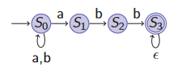

Il non determiniscmo è dato dalla presenza dalla presenza di più stati nell'immagine della funzione move$_n(S_0,a)$, che va sia in $S_0$ sia in $S_1$.
Possiamo anche creare una rappresentazione tabellare della funzione di transizione:
| | $\varepsilon$ | $a$ | $b$ |
| --- | --- | ---| ---|
| $S_0$      | $\emptyset$ | {$S_0, S_1$} | {$S_0$} |
| $S_1$   | $\emptyset$ | $\emptyset$ | {$S_2$} |
| $S_2$ | $\emptyset$ | $\emptyset$ | {$S_3$} |
| $S_3$ | {$S_3$} | $\emptyset$ | $\emptyset$|
### Linguaggi accettati
Un NFA $\mathcal{N}$ accetta/riconosce una parola $w$ se e solo se esiste almeno un cammino che fa lo spelling di $w$ da $s_0$ ad uno stato di $F$.
Il linguaggio accettato da $\mathcal{N}$, detto $L(\mathcal{N})$ è l'insieme delle stringhe accettate da $\mathcal{N}$.
#### Esempio 1

Il linguaggio accettato è $L((a|b)^*abb*)$.
#### Esempio 2
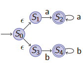
Il linguaggio generato è $L(aa^* | bb^*)$.
### Costruzione di Thompson
Un algoritmo che permette di costruire un NFA $\mathcal{N}$, partendo da una regex $r$, tale che $L(\mathcal{N}) = L(r)$.
La costruzione è basata sulla definizione induttiva di regex:
* **Caso base:** $r$ è $\varepsilon$ oppure un simbolo dell'alfabeto
	* Definisco un NFA per riconoscere $L(\varepsilon)$
	* Definisco un NFA per riconoscere $L(a)$
* **Passo induttivo:** $r$ è $r_1 | r_2$ oppure $r_1 r_2$ oppure $r^*_1$ oppure ($r$)
	* Dati due NFAs $\mathcal{N}_1$ e $\mathcal{N}_2$ tali che $L(\mathcal{N}_i) = L(r_i)$ per $i = 1, 2$
		* Definisco un NFA per riconoscere $L(r_1|r_2)$
		* Definisco un NFA per riconoscere $L(r_1 r_2)$
		* Definisco un NFA per riconoscere $L(r^*_1)$
		* Definisco un NFA per riconoscere $L((r_1))$
Graficamente la base della costruzione di Thompson è:

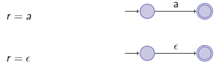

Mentre il passo induttivo come:

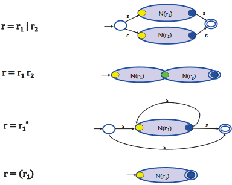

Ogni passo per la costruzione introduce al più 2 nuovi stati, quindi l'NFA generato ha al più $2k$ stati, con $k$ il numero di simboli e di operatori nell'espressione regolare.
In ogni NFA intermedio ci sono:
* Esattamente uno stato finale
* Nessun vertice entrante nello stato iniziale
* Nessun vertice uscente dallo stato finale
#### Complessità
Consideriamo di costruire un NFA con $n$ nodi e $m$ archi, ogni passo aggiunge al più 2 stati e 4 nodi.
Consideriamo ogni passo svolto in tempo costante, abbiamo un totale di $|r|$ passi, allora:
* **Spaziale:** $n + m$ ovvero $O(|r|)$
* **Temporale:** $O(|r|)$
#### Esempio di applicazione
Supponiamo di avere la regex $r = (a|b)^*abb$, dobbiamo inanzitutto scomporla in sotto-regex.$$r_1 = (a|b) \hspace{2em} \to \hspace{2em} r_2 = r_1^* = (a|b)^* \hspace{2em} \to \hspace{2em} r_3 = r_2 \cdot abb = (a|b)^*abb$$
Ora possiamo iniziare la costruzione di Thompson partendo da $r_1$ e aggiungendo pezzi fino a $r_3$:
Iniziamo con l'automa per $r_1$:

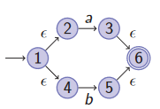

Ora dobbiamo implementare la *Klenee star* per poter ripere $r_1$ 0 o più volte:

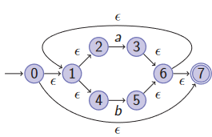

Infine passiamo all'automa per $r_3$ nel quale semplicemenete prendiamo quello per $r_2$ e facciamo l'append di $abb$:

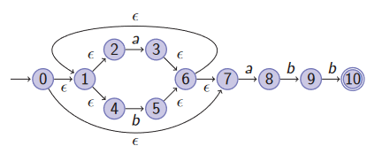

## Simulazione di NFAs
Dopo aver costruito il nostro NFA dobbiamo verificare su una parola $w \in L(\mathcal{N})$.
Per poter fare questa verifica ci serve *simulare l'auotma*, dobbiamo trovare un'algoritmo formale in grado di poter fare questa verifica senza usare *backstrack* che farebbe aumentare assurdamente il costo della funzione.
Inanzitutto potremmo eliminare le $\varepsilon$-transizioni, che aggiungono solo molto overhead ai nostri algoritmi, introduciamo così le $\varepsilon$-chiusure.
### $\varepsilon$-closure
Sia ($S, \mathcal{A}, \text{move}_n, s_0, F$) un NFA, sia $t \in S$ e sia $T \subset S$.
Definiamo $\varepsilon$-closure({$t$}) l'insieme di stati in $S$ che sono raggiungibili da $t$ tramite 0 o più $\varepsilon$-transizioni (posso raggiungere anche $t$ stesso).
Definiamo invecete $\varepsilon$-closure($T$) come: 
$$\varepsilon - \text{closure}(T) = \bigcup_{t \in T} \varepsilon - \text{closure}(\{t\})$$
#### Computazione
Per eseguire l'algoritmo useremo le seguenti strutture dati:
* Uno stack;
* Un array di boolean `alreadyOn` di dimensione $|S|$ per verificare in tempo costante se uno stato $t$ è nello stack;
* Una matrice per registrare move$_n$, ogni entry ($t, x$) è una linked list contenente tutti gli stati raggiungibili con una $x$-transizione da $t$.
Supponiamo di avere la struttura move$_n$ con scope globale.
````
function closure-wrapper()
	Stack S = Stack();
	foreach index = 1 in |S| do
		alredayOn[index] = False;
	closure(t,S)

function closure(State t, Stack S)
	S.push(t);
	alreadyOn[t] = True;
	foreach u ∈ move(t,ε) do
		if not alreadyOn[u] then
			closure(u,S);
````
#### Complessità
Le righe:
1. `S.push(t)`
2. `set alreadyOn[t]`
3. `find u ∈ move(t,ε)`
4. `test alreadyOn[u]`
Vengono eseguite in tempo costante, dobbiamo allora trovare ogni quante volte vengono riptute.
Le righe 1 e 2 vengono eseguite ad ogni invocazione, ogni stato va nello stack al più una volta per via di `alreadyOn`, assumendo di avere $n$ stati abbiamo $O(n)$.
Le righe 3 e 4 vengono eseguite per ogni u $\in$ move$(t,\varepsilon)$, nel caso peggiore ogni stato va nello stack e ogni stato ha almeno una $\varepsilon$-transazione, quindi se abbiamo $m$ archi $O(m)$.
Concludendo l'algoritmo delle $\varepsilon$-closure ha complessità $O(n+m)$.
### Algoritmo per la simulazione
````
input : NFA N = (S, A, move, s0, F ), w$
output : “yes” if w ∈ L(N), “no” otherwise

states = ε-closure({s0});
symbol = nextchar();
while symbol != $ do
	states = ε-closure(⋃t∈states move(t, symbol));
	symbol = nextchar();
if states ∩ F != ∅ then
	return “yes”;
else
	return “no” ;
````
#### Esempio di simulazione

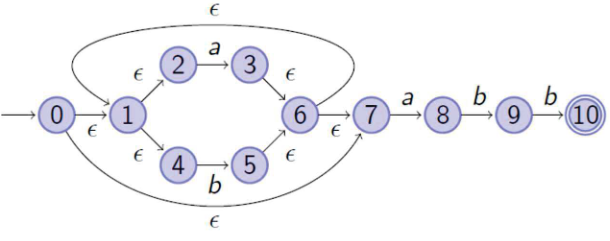

Dato l'NFA sopra pensiamo di dover verificare cha la parola $w = ababb$ appartenga o meno al linguaggio generato da esso.
Ci serviamo di una tabella per vedere meglio i passaggi:
| states | symbol | move | $\varepsilon$-closure |
| --- | --- | --- | --- |
| $T_0$={0,1,2,4,7} | a | {3,8} | {1,2,3,4,6,7,8} |
| $T_1$={1,2,3,4,6,7,8} | b | {5,9} | {1,2,4,5,6,7,9} |
| $T_2$={1,2,4,5,6,7,9} | a | {3,8} | $T_1$ |
| $T_1$ | b | {5,9} | $T_2$|
| $T_2$ | b | {5,10} | {1,2,4,5,6,7,10} |
| $T_3$={1,2,4,5,6,7,10} | $ | | |
#### Complessità 
La comeplessità non costante è data dal ciclo `while`.
Lo speudo-codice è semplificato, nella realtà avremmo bisogno di una paio di strutture dati per immagazzinare gli stati.
* Uno stack per lo stato corrente, ovvero gli stati a sinistra dell'assegnamento dentro il `while`.
* Uno stack per tenere traccia dei nuovi stati dati dall'unione della funzione `ε-closure`.
Dobbiamo quindi usare una funzione per scambiare i contenuti dei due stack, con complessità $\Theta (x)$ perchè dobbianmo sempre scambiare tutti gli $x$ elementi dello stack.
Ora assumiamo che il nostro NFA abbia $n$ stati e $m$ archi.
Per ogni ciclo `while` devo:
* Popolare il nuovo stack con complessità $O(n+m)$, devo fare le `ε-closure`.
* Scambiare le stack con complessità $O(n)$.
Il ciclo viene ripetuto per tutta la lunghezza di $w$, quindi $O(|w|(n+m))$, nel caso specifico in cui l'NFA derivi dalla costruzione di Thompson $|r| = n+m$ quindi posso scrivere $O(|w||r|)$.
### Conclusione sugli NFA
Dati una regex $r$ ed una parola $w$, quanto costa capire se $w \in L(r)$?
Applico l'algoritmo della costruzione di Thompson con $O(|r|)$.
Simulo l'NFA ottenuto con $O(|w||r|)$.
In conclusione ho $O(|w||r|)$.
## Digressione sulle $\varepsilon$-closure
### Teorema sulle $\varepsilon$-closure
Sia ($S, \mathcal{N}, \text{move}_n, s_0, F$) un NFA e sia $M \subseteq S$.
Allora la $\varepsilon$-closure(M) è il più piccolo insieme $X \subseteq S$ tale che $X$ sia una soluzione di:
$$X = M \cup \{ N^\prime \ | \ N^\prime \in \text{move}_n (N, \varepsilon) \land N \in X \}$$
#### Nota
Diciamo il più piccolo per evitare di incorrere in loop infiniti come nel caso di cicli composti da $\varepsilon$-transizioni.
La formula va letta come: $X$ è composto da $M$ più tutti gli stati $N^\prime$ che sono raggiungibili da $N$ tramite una $\varepsilon$-transizione, con $N$ uno stato di $X$.
Sembra una formula impossibile da calcolare visto che per trovare $X$ dovrei avere già $X$, invece grazie al teorema del punto fisso è calcolabile.
### Teorema del punto fisso
L'equazionaccia vista prima è una particolare equazione su insiemi che prende la forma generale di $X = f(X)$.
#### Teorema
Sia $f: 2^D \to 2^D$ per un insieme finito $D$ e sia inoltre $f$ monotona, quindi se $X \subseteq Y$ allora $f(X) \subseteq f(Y)$.
Allora $\exists m \in \mathbb{N}$ tale per cui esiste un'unica soluzione minima dell'equazione $X = f(X)$ che è $f^m (\emptyset)$.
#### Dimostrazione
Prima dimostriamo che $\exists m \in \mathbb{N}$ tale che $f^m(\emptyset)$ è soluzione di $X = f(X)$.
Per definizione abbiamo immediatamente che $\emptyset \subseteq f(\emptyset)$ e per la monotonia della funzione allora $f(\emptyset) \subseteq f^2(\emptyset)$.
Per il principio di induzione possiamo affermare che $f^i(\emptyset) \subseteq f^{i+1}(\emptyset) \ \forall i \in \mathbb{N}$, abbiamo quindi una catena $\emptyset \subseteq f^1(\emptyset) \subseteq f^2(\emptyset) \subseteq f^3(\emptyset) \dots$
Visto che l'insieme $D$ non è infinito la mia catena dovrà arrivare ad un punto in cui un insieme sarà uguale ad un altro, quindi per un qualche $m$ si ha che $f^m(\emptyset) = f^{m+1}(\emptyset) = f(f^m(\emptyset))$, guarda caso ho proprio dimostrato la forma $X = f(X)$.

Ora proviamo che $f^m(\emptyset)$ è l'unica soluzione minima.
Poniamo per assurdo che esista una soluzione $A$, allora per ipotesi $A = f(A)$ e quindi $A = f(A) = f^2(A) = \dots = f^m(A)$.
Sappiamo che $\emptyset \subseteq f(A)$ allora per monotonia della funzione $f^m(\emptyset) \subseteq f^m(A)$ .
Allora sapendo che $f(A) = A$ possiamo concludere che $f^m(\emptyset) \subseteq A$, quindi $f^m(\emptyset)$ è l'unica soluzione minima.
## Deterministic Finite state Automata (DFA)
Definiamo un automa a stati finiti deterministico come la tupla 
$$ \mathcal{D} = (S, \mathcal{A}, \text{move}_d, s_0, F)$$
Dove tutte le componenti sono unguali ad un NFA fatta eccezione per la funzione di transizione, infatti è definta come:
$$\text{move}_d : S \times \mathcal{A} \to S$$
E' possibile notare molto velocemente alcune caratteristiche di questa funzione che si ripercuotono su tutti i DFA:
* In tutti i DFA non esistono $\varepsilon$-transizioni per via di com'è definito il dominio della funzione move$_d$.
* Se move$_d$ è *totale* allora per ogni stato c'è **esattamente** una una $a$-transizione $\forall a \in \mathcal{A}$.
* Se move$_d$ è *parziale* allora per ogni stato esiste **al più** una $a$-transizione $\forall a \in \mathcal{A}$.
## Simulazione di DFAs
### Linguaggio riconosciuto
Il linguaggio accettato da un DFA $\mathcal{D}$, denotato da $L(\mathcal{D})$, è l'insieme delle parole $w$ tali che:
* O esiste un cammino che fa lo spelling $w = a_1 \dots a_k$ con $k \geq 1$ dallo stato iniziale di $\mathcal{D}$ ad uno finale.
* Oppure lo stato iniziale è anche finale $w = \varepsilon$.
### Simulazione con funzione di transizione totale
Iniziando dallo stato inziale seguo il cammino che fa lo spelling di $w$, se raggiungo uno stato finale ritorno "yes", altrimenti ritorno "no".
### Simulazione con funzione di transizione parziale
Iniziando dallo stato iniziale seguo il cammino che fa lo spelling di $w = a_1 \dots a_k$, se per qualche carattere $a_i$ non esiste uno stato "target" ritorno immediatamente "no".
Se raggiungo uno stato finale allora ritorno "yes",altrimenti ritorno "no".
### Funzione parziale vs. totale
Dato un DFA $\mathcal{D}$ con funzione di transizione parziale posso allora definire un altro DFA $\mathcal{D}^\prime$ con funzione di transizione totale tale che $L(\mathcal{D}) = L(\mathcal{D}^\prime)$.
Devo usare dgli stati "morti" detti sink, ovvero uno stato che srà l'oobbiettivo di tutte le transizioni mancanti e avrà dei self-loop per ogni lettera del mio alfabeto.
## Costruzione dei subset
Dato un NFA $\mathcal{N}$ devo costruire un DFA $\mathcal{D}$ tale che $L(\mathcal{D}) = L(\mathcal{N})$.
**Idea:** Uso le $\varepsilon$-closure per mappare i subset degli stati di un NFA in un singolo stato di un DFA.
### Algoritmo
````
input : NFA N = (S, A, moven , s0, F )
output : DFA D = (R, A, moved , t0, E ) such that L(D) = L(N)
t0 = ε-closure({s0});
R = {t0};
set t0 as unmarked;
while some T ∈ R is unmarked do
	mark T;
	foreach a ∈ A do
		T' = ε-closure(⋃t∈T moven(t, a));
		if T' != ∅ then
			moved(T, a) = T';
			if T' ∉ R then
				add T' to R;
				set T' as unmarked;
foreach T ∈ R do  
	if (T ∩ F) != ∅ then set T ∈ E;
````
### Complessità
La complessità è data dal ciclo `while`, dal ciclo `foreach` annidato e dalla computazione delle $\varepsilon$-closure.
Dobbiamo fare delle premesse, poniamo che l'NFA abbia $n$ stati e $m$ archi, mentre il DFA in output abbia $n_d$ stati.
* Il ciclo `while` va a scorrere tutti gli stati del DFA contenuti in `R`  per verificare `unmarked` nel caso peggiore $O(n_d)$.
* Il ciclo `foreach` annidato scorre ogni singolo elemento dell'alfabeto e quindi viene ripetuto $\Theta (|\mathcal{A}|)$ volte.
* Infinme il calcolo delle $\varepsilon$-closure ha costo $O(n+m)$.
Risulta che la complessità finale $O(n_d \cdot |\mathcal{A}| \cdot (n+m))$.
### Esempio
Proviamo ora dato un NFA a convertirlo in DFA.

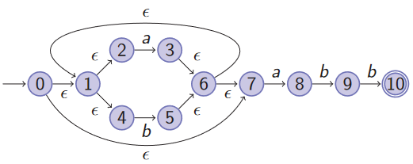

Prima cosa cerco tutto l'alfabeto, ho solo due lementi $a$ e $b$, quindi dovrò fare le $\varepsilon$-cchiusure solo di questi per ogni nodi.
| Stati | $\varepsilon$-closure $a$-transizioni | $\varepsilon$-closure $b$-transizioni |
| --- | --- | --- |
| $\varepsilon (0) = T_0 =$ {0,1,2,4,7} | $\varepsilon (3,8) = T_1 =$ {1,2,3,4,6,7,8} | $\varepsilon (5) = T_2 =$ {1,2,4,5,6,7} |
| $T_1 =$ {1,2,3,4,6,7,8} | $\varepsilon (3,8) = T_1$ | $\varepsilon (5,9) = T_3 =$ {1,2,4,5,6,7,9} |
| $T_2 =$ {1,2,4,5,6,7} | $\varepsilon (3,8) = T_1$ | $\varepsilon (5) = T_2$ |
| $T_3 =$ {1,2,4,5,6,7,9} | $\varepsilon (3,8) = T_1$ | $\varepsilon (5,10) = T_4 =$ {1,2,4,5,6,7,10} |
| $T_4 =$ {1,2,4,5,6,7,**10**} | $\varepsilon (3,8) = T_1$ | $\varepsilon (5) = T_2$ |

Facendo una rappresentazione grafica:

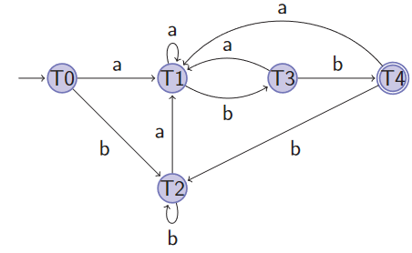

Come si può notare non è il miglior DFA che possiamo ottenere, ma è comunque un DFA valido per linguaggio $L((a|b)^*abb)$.
## Minimizzazione DFA
Dato un DFA $\mathcal{D}$ devo ottenere un DFA $\mathcal{D^\prime}$, con il minor numero di stati possibile, tale che $L(\mathcal{D^\prime}) = L(\mathcal{D})$.
L'idea è he ci sono degli stati rindondanti, ovvero presi due stati $s$ e $t$ allora:
$$\forall a \in \mathcal{A}^*, \text{move}^*_d(s,a) \in F \iff \text{move}^*_d(t,a) \in F$$
### Equivalenza di stati
Sia $\mathcal{D} = (S, \mathcal{A}, \text{move}_d, s_0, F)$ un DFA con funzione di transizione totale , allora $s,t \in S$ sono equivalenti se e solo se vale:
$$\forall a \in \mathcal{A}^*, \text{move}^*_d(s,a) \in F \iff \text{move}^*_d(t,a) \in F$$
Dove la funzione di transizione multi-passo move$^*_d$ è definita con l'induzione sulla lunghezza della stringa.
* $\text{move}^*_d (s, \varepsilon) = s$
* $\text{move}^*_d (s, wa) = \text{move}^*_d(\text{move}^*_d(s,w),a)$
### Raffinamento delle partizioni
Con questo processo arriveremo a dividere gli stati in blocchi, ovvero sottoinsiemi disgiunti di $S$.
Iniziamo con 2 blocchi:
* $B_1 = F$
* $B_2 = S \backslash F$
Facciamo questa scelta perchè con $s \in B_1$ e $t \in B_2$ non sono equivalenti perchè $\text{move}^*_d (s, \varepsilon) \in F$ e $\text{move}^*_d (t, \varepsilon) \notin F$.
Per i passi successivi dobbiamo verificare che in ogni blocco ci siano solo stati equivalenti.
Se tutti gli stati un $B_i = \{ s_1, \dots , s_k\}$ sono equivalenti allora $\forall a \in \mathcal{A}$ gli stati obbiettivo delle $a$-transizioni da $s_1, \dots , s_k$ sono tutti nello stesso blocco.
Il blocco $B_i$ può essere diviso se per qualche $s,t \in B_i$ $\text{move}_d(s,a) \in B_j \land \text{move}_d(t,a) \notin B_j$, la divisione si compie dividendo in due insiemi:
* {$s \in B_i \ | \ \text{move}_d(s,a) \in B_j$}
* {$s \in B_i \ | \ \text{move}_d(s,a) \notin B_j$}
Si noti che se non abbiamo un DFA con funzione cNompleta possiamo sempre aggiungere un *sink* e il min-DFA in output non è detto abbia una funzione totale.
#### Esempio 1

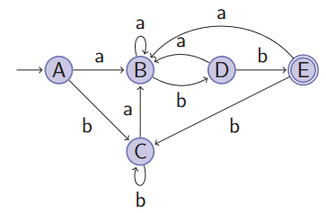

Creo i blocchi iniziali $B_1 = \{E\}$ e $B_2 = \{A,B,C,D\}$.
Separo $B_2$: $B_1=\{E\},\ B_{21} = \{D\},\ B_{22} = \{A,B,C\}$ .
Separo $B_{22}:$ $B_1 = \{E\},\ B_{21} = \{D\}, \ B_{221} = \{B\}, \ B_{222} = \{A,C\}$.

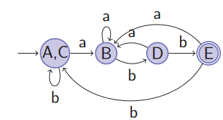

#### Esempio 2
Dato il seguente DFA con funzione parziale restituire il DFA minimizzato.

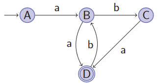

Avendo una funzione parziale posso aggiungere un *sink* per rendere la funzione totale.

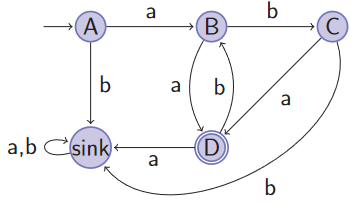

Iniziamo con $B_1 = \{D\}$ e $B_2 = \{A,B,C,sink\}$.
Separo $B_2$ perchè $\text{move}_d(C/B,a) \in B_1$, $B_1 = \{D\}$ e $B_{21} = \{A,sink\}$ e $B_{22} = \{B,C\}$.
Separo $B_{21}$ perchè $\text{move}_d(A,a) \in B_{22}$, $B_1 = \{D\}$ e $B_{211} = \{A\}$ e $B_{212} = \{sink\}$ e $B_{22} = \{B,C\}$.
Infine separo $B_{22}$ perchè $\text{move}_d(C,b) \in B_{212}$, $B_1 = \{D\}$ e $B_{211} = \{A\}$ e $B_{212} = \{sink\}$ e $B_{221} = \{B\}$ e $B_{222} = \{C\}$.
Risulta che il DFA è già minimizzato.
### Dimensioni di un DFA
#### Lemma
$\forall n \in \mathbb{N}^+$ esiste un NFA con $n+1$ stati il cui DFA minimo ha almeno $2^n$ stati e una funzione di transizione totale.
#### Dimostrazione
Prendiamo il il linguaggio $L=((a|b)^* a (a|b)^{n-1})$, allora ci sarà un NFA che accetta $L$ con almeno $n+1$ stati.

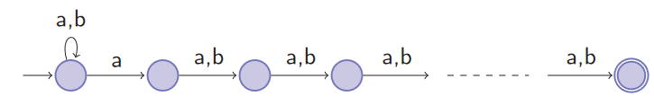

Allora per contraddizione, poniamo esista un DFA $\mathcal{D}$ che accetta $L$ e ha $k < 2^n$ stati.
Sappiamo che nel linguaggio $L$ ci sono esattamente $2^n$ parole distinte con la lunghezza $n$.
Allora ci sono due percorsi in $\mathcal{D}$ tali che:
* La lunghezza è $n$.
* Compongono rispettivamente $w_1$ e $w_2$ con $w_1 \neq w_2$.
* Condividono almeno un nodo.
Allora per degli stati $x_1, x_2$ e  $x$; ho due possibilità mutualmente esclusive.
* $w_1 = x_1 a x$ e $w_2 = x_2 b x$
* $w_1 = x_1 b x$ e $w_2 = x_2 a x$
Possiamo supporre senza problemi che $w_1 = x_1 a x$ e $w_2 = x_2 b x$.
Allora possiamo definire $w^\prime_1 = x_1 a b^{n-1} \in L$, lo stato che raggiunge $w^\prime_1$ in $\mathcal{D}$ è finale.
Ma allora ho una contraddizione perchè lo stato non può essere finale visto che è raggiunto anche da $x_2bb^{n-1} \notin L(\mathcal{D})$.
## Pumping lemma per linguaggi regolari
### Lemma
Sia $L$ un linguaggio regolare, allora:
* $\exists p \in \mathbb{N}^+$
* $\forall z \in L$ tale che $|z| > p$
* $\exists u,v,w$ tali che:
	* $z = uvw \ \land$
	* $|uv| \leq p \ \land$
	* $|v| > 0 \ \land$
	* $\forall i \in \mathbb{N}. uv^iw \in L$
### Dimostrazione
Sia $L$ un linguaggio regolare, allora esiste un DFA $\mathcal{D} = (S, \mathcal{A}, \text{move}_n, s_0, F)$ tale che $L = L(\mathcal{D})$.
Sia $p = |S| - 1$, allora tutti i cammini da $s_0$ a qualche stato finale che attraversano al più una volta ogni stato hanno lunghezza limitata da $p$.
Allora per una parola $z$ vale $|z| > p$, allora possiampo scomporre $z$ in $z = a_1 \dots a_p z^\prime$ e siamo sicuri che almeno uno stato, chiamiamolo $s^*$, è stato attraversato più di una volta durante $a_1 \dots a_p$.
Questo implica che esiste un ciclo in $\mathcal{D}$ che parte da $s^*$ e torna in $s^*$, questo ciclo può essere indicato come $a_{i+1} \dots a_j$ con $i  < j \leq p$.
Possiamo ora scomporre la parola in:
* $u = a_1 \dots a_i$
* $v = a_{i+1} \dots a_j$ (sarebbe il ciclo, ovvero il termine pompabile)
* $w = \begin{cases} z^\prime & j = p\\ a_{j+1} \dots a_p z^\prime & j < p \end{cases}$
Possiamo quindi dire che $|uv| \leq p$ e che $|v| > p$ perchè per definizione un ciclo tocca almeno un nodo, ed essendo quindi un ciclo può essere ripetuto un numero indefinito di volte mantenendo comunque $\forall i \in \mathbb{N} . uv^iw \in L(\mathcal{D})$.
### Applicazioni del pumping lemma
Mostra per contraddizione che un linguaggio non è regolare.
* Assumiamo il linguaggio regolare.
* Mostriamo che not(Thesis) è vera.
	* **Thesis:** $\exists p \in \mathbb{N}^+ . \forall z \in L : |z| > p . \exists u,v,w . P$
	  Dove
	  $P \equiv (z = uvw \land |uv|\leq p \land |v| > 0 \land \forall i \in \mathbb{N} . uv^iw \in L)$
	* **not(Thesis):** $\forall p \in \mathbb{N}^+ . \exists z \in L : |z| > p . \forall u,v,w . Q$
	  Dove
	  $Q \equiv (z = uvw \land |uv| \leq p \land |v| > 0)$ implica che $(\exists i \in \mathbb{N} . uv^iw \notin L)$
#### Esempio
Proviamo a dimostrare che $L = \{a^nb^n | n > 0\}$ non è regolare.
Assumiamo che $L$ sia regolare e prendiamo la parola $z = a^p b^p$, partizioniamo ora i termini come segue $u = a_1 \dots a_x$, $v = a_{x+1} \dots a_p$ e infine $w = b_1 \dots b_p$.
Il partizionamento scelto rispetta i vincoli dell'ipotesi perchè:
* $|uv| \leq p$ contenendo solo $a$.
* $|v| > 0$ perchè $v$ contiene almeno un'occorenza di $a$.
Possiamo ora scegliere $i = 0$ e vedere che la parola diventa $uv^0w = a^xb^p$ con $x < p$, abbiamo quindi dimostrato che $uv^0w \notin L$ e quindi il linguaggio non è regolare.
## Chiusure dei linguaggi regolari
### Unione
Questa proprietà è visibile graficamente tamite l'algoritmo di Thompson, basta prendere gli automi per i due linguaggi e fare l'*alternanza*.
### Concatenazione
Anche per questa chiusura è possibile costruire un NFA che accetti il nuovo linguaggio usando le regole Thompson.
### Complementazione
Prendiamo il linguaggio $L$ su un certo alfabeto $\mathcal{A}$, allora il complementare del linguaggio è dato da $\mathcal{A} \backslash L$ ed è sicuramente regolare (non ho trovato una dimostrazione).
### Intersezione
Per dimostrarla possiamo ricondurci al caso dell'unione con *De Morgan*.
$$L_1 \cap L_2 = \lnot (\lnot (L_1 \cap L_2)) = \lnot (\lnot L_1 \cup \lnot L_2)$$
Ora avendo detto che l'unione ed la complementazione di due linguaggi regolari $L_{1,2}$ è regolare lo è qnche la sua intersezione.
## Analisi lessicale
In questa fase vogliamo identificare quali parti del nostro codice corrispondono alle *keyword*, tipo identificatori, operatori, ecc...
Gli elementi che vogliamo riconoscere prendono il nome di *lessemi* ed il nostro obbiettivo è trasformarli in un flusso di token che andranno a costruire i terminali della nostra grammatica.
Tpicamente esistono token univoci:
* per ogni keyword tipo `for`, `while`, ecc...
* per ogni operatore, infatti in C `+` e `++` hanno token diversi
* un token univoco per tutti gli identificatiori
* un token per ogni segno di punteggiatura
### Obbiettivo
L'obbiettivo dell'analizzatore lessicale è riconoscere i *lessemi*, ovvero quelle porzioni di codice che corrispondono ai vari token e ritornarli.
Tipicamente vengono ritornati delle tuple, solitamente \<token-nome\> oppure \<token-valore\>:
* \<token-nome\> è il nome scelto per indicare quello specifico token.
* \<token-valore\> è un puntatore alla symbol tabel che contiene le informazioni di quel token.
### Lessemi
Sono descritti da regex e vengono riconosciuti da un automa a stati che esegue istruzioni specifiche quando riconosce una parola.

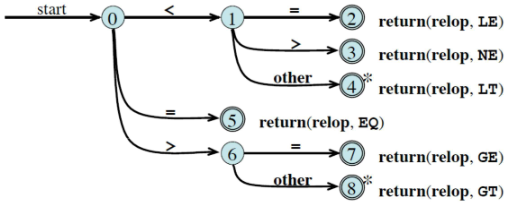

### Pattern matching basato su NFAs
Viene simulato un NFA i cui stati finali sono associati a delle azioni.
1. Simuliamo l'NFA.
2. Continuiamo la smiluazione finchè nessun'altra azione è possibile, ovvero per *longest match*.
3. Se nell'insieme di stati in cui siamo ci sono delle azioni le eseguiamo, eseguiamo le istruzioni dalla prima all'ultima, in caso di parità ci sono delle priorità d rispettare.
4. Se invece non ci sono azioni dobbiamo tornare indietro nella simulazione fino a trovare un'insieme di stati valido con azioni.
   Nel nostro andare indietro dobbiamo ricordarci di far scorrere il puntatore al buffer di input.
Possiamo fare il pattern matching anche su DFAs, basta tradurre e semplificare il nostro NFA.