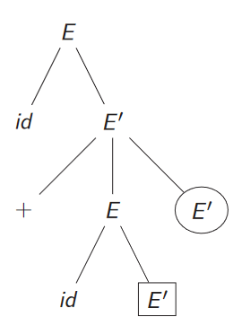
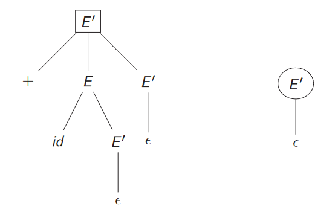
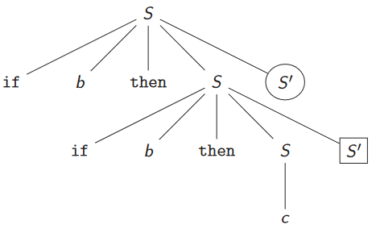

## Parsing
Data una grammatica $\mathcal{G} = \{ V, T, S, P \}$ e una parola $w$, il parsing serve a verficare se $w \in L(\mathcal{G})$ e fornisce un albero di derivazione.  
I due maggiori approcci al parsing sono:
* Top-down: costruiamo le derivazioni leftmost dalla radice alle foglie
* Bottom-up: costruiamo le derivazioni rightmost dalle foglie alla radice (questo è l'approccio così detto *ganzo* dalla Quaglia)
## Top-down parsing
Esempio 1  
Sia $w = cad$ e la grammatica
$$ \mathcal{G} : \begin{cases} S \to cAd \\ A \to ab|a \end{cases}$$
Ad occhio sembra molto semplice, ma per l'algoritmo non è semplice distinguere quale non terminare scegliere.  
Dovremmo usare del *backtrack* per poter decidere il terminale, ma sappiamo bene che questo apprioccio fa schizzare i costi alle stelle.
## Predictive Top-down parsing
In questo caso non è necessario applicare *backtrack* poichè facciamo riferimento ad una classe di grammatiche dette **grammatiche LL(1)**, vengono chiamate così perchè per essere analizate:
* Leggiamo la parola in input da sinistra a destra.
* Eseguiamo solo produzioni leftmost.
* Guardiamo un solo simbolo (non-terminale).
Tali grammatiche posso essere parsate senza usare *backtrack* ed in modo completamente deterministico.

Prendiamo un """semplice""" esempio (Se dice ancora semplice mi alzo e me ne vado).
$$\mathcal{G}:\begin{cases}E \to TE^\prime \\ E^\prime \to +TE^\prime|\varepsilon \\ T \to FT^\prime \\ T^\prime \to *FT^\prime|\varepsilon \\ F \to (E)|id \end{cases}$$
Per le grammatiche LL(1) possiamo creare una tabella di parsing per guidare le derivazioni leftmost.

|    | id | + | * | ( | ) | $ |
| --- | --- | --- | --- | --- | --- | ---|
| $E$ | $E \to TE^\prime$|  |  | $E \to TE^\prime$ |  |  |
| $E^\prime$ |  | $E^\prime \to +TE^\prime$ |  |  | $E^\prime \to \varepsilon$ | $E^\prime \to \varepsilon$ |
| $T$ | $T \to FT^\prime$ |  |  | $T \to FT^\prime$ |  |  | 
| $T^\prime$ |  | $T\prime \to \varepsilon$ | $T^\prime \to ∗FT^\prime$ |  | $T^\prime \to \varepsilon$ | $T^\prime \to \varepsilon$|  
| $F$ | $F \to id$ |  |  | $F \to (E)$ |  |  |

Quindi data una parola $w$ dobbiamo leggerla e, consumando l'input, fare la produzione nella casella $[ T,w[i]]$.  
Se capitiamo in una casella che è vuota dobbiamo laniare un errore.
### Algoritmo
````
input: w;
output: derivazioni leftmost per w, altrimenti error();
Stack S = Stack();
S.push($);
S.push(A);       //Ipotizziamo che lo start symbol sia A
b = w$.firstSymbol();
X = S.top();
while X != $ do
	if X == b then
		S.pop();
		b = w$.nestSymbol();
	else if isTerminal(X) then
		error();
	else if M[X ,b] == error then
		error();
	else if M[X , b] = X → Y1 . . . Yk then
		output(X → Y1 . . . Yk );
		S.pop();
		push Yk;
		. . . ;       //Metto nello Stack S solo i non-terminali
		push Y1;
	X = S.top();
````

### Tabella di parsing
L'algoritmo per fare il parsing ha una complessità lineare con $O(|w|)$, ma si basa su una teblla, come costruiamo tale tabella?  
La cella $M[A,b]$ è consultata quando devo espandere $A$ ed il prossimo carattere in input è $b$.  
Questo signica che dobbiamo assegnare la cella $M[A,b] = A \to \alpha$ se :
* Se nel body della nosra produzione con 0 o più derivazioni riesco ad avere come primo carattere la $b$, ovvero $\alpha \implies^* b \beta$. (concetto di first)
* Oppure se $\alpha \implies^* \varepsilon$ ed è possibile avere $S \implies^* wA\gamma$ con $\gamma \implies^* b \beta$. (concetto di follow)
## $first(\alpha)$
### Definizione "normale"
Chiamiamo $first(\alpha)$ l'insieme dei terminali che sono situati all'inizio delle stringhe che derivano da $\alpha$.  
Se $\alpha \implies^* \varepsilon$ allora $\varepsilon \in first(\alpha)$ è un non terminale che è *nullable* ovvero dopo alcuni passi di derivazione diventerà la parola vuota $\varepsilon$.
### Definizione ricorsiva
* **Casi base:**
	* $first(\varepsilon) = \{ \varepsilon \}$
	* $first(a) = \{a\}$
* **Passo ricorsivo:**
	* $first(A) = \bigcup_{A \to \alpha} first(\alpha)$
### Algoritmo
````
input: w;
output: l'insieme dei first di una stringa
Set first(Y1 . . . Yn) = ∅;  
j = 1;
while j ≤ n do  
	first(Y1 . . . Yn).add(first(Yj) \ {ε});
	if ε ∈ first(Yj) then
		j = j + 1;
	else
		break;
if j = n + 1 then
	first(Y1 . . . Yn).add(ε);
````
### Esempio
Data la grammatica $\mathcal{G}$ generare i $first$ di ogni non terminale.
$$\mathcal{G}:\begin{cases}E \to TE^\prime \\ E^\prime \to +TE^\prime|\varepsilon \\ T \to FT^\prime \\ T^\prime \to *FT^\prime|\varepsilon \\ F \to (E)|id \end{cases}$$
Facciamo qualche esempio:
* $first(E) \implies first(T) \implies first(F) \implies \{(,id\}$
* $first(E^\prime) \implies \{+, \varepsilon\}$

|  | first |
| ---| --- |
| $E$ | {$(, id$} |
| $E^\prime$ | {$+, \varepsilon$} |
| $T$ | {$id, ($} |
| $T^\prime$ | {$\varepsilon, *$} |
| $F$ | {$id, ($} |
## $follow(A)$
La funzione $follow$ accetta come unico argomento un non-terminale.
### Definizione
Con $follow(A)$ indichiamo l'insieme dei terminali che possono seguire $A$ in qualche derivazione.
### Algoritmo
````
input: un terminale A;
output: void andiamo semplicemente a modificare dei set follo(A) che noi pensiamo avere scope globale;
follow(S) = {$};  
foreach A != S do  
	follow(A) = ∅;  
repeat  
	foreach B → αAβ do  
		if β != ε then  
			follow(A).add(first(β) \ {ε});
		if β == ε or ε ∈ first(β) then  
			follow(A).add(follow(B)); 
until saturation;
````
I due `if` meritano una spiegazione:
* `β != ε`, allora A deve essere sempre seguito da una parola non vuota per cui aggiungo i $first(\beta) \backslash \{\varepsilon\}$ ovvero solo i primi terminali che $\beta$ può generare.
* `β == ε or ε ∈ first(β)` quindi se ho la parola vuota oppure $\beta$ è *nullable* posso dire che ciò che segue $B$ seguirà anche $A$.
### Esempio
Data la grammatica $\mathcal{G}$ generare i $follow$ di ogni non terminale.
$$\mathcal{G}:\begin{cases}E \to TE^\prime \\ E^\prime \to +TE^\prime|\varepsilon \\ T \to FT^\prime \\ T^\prime \to *FT^\prime|\varepsilon \\ F \to (E)|id \end{cases}$$
Inizio in maniera "ricorsiva" dall'ultimo al primo terminale.
Iniziamo per punti:
1. Iniziamo con $follow(E) = \$$
2. Prendiamo la prima produzione $E \to TE^\prime$ con $B = E$, $\alpha = T$, $A = E^\prime$ e $\beta = \varepsilon$, allora:
	1. False
	2. $follow(E^\prime).add(follow(E))$
3. Prendiamo la prima produzione $E \to TE^\prime$ con $B = E$, $\alpha = \varepsilon$, $A = T$ e $\beta = E^\prime$, allora: 
	1. $follow(T).add(first(E^\prime) \backslash \{\varepsilon\})$
	2. $follow(T).add(follow(E))$
4. Prendiamo $E^\prime \to + T E^\prime$ con $B=E^\prime$, $\alpha = +T$, $A = E^\prime$ e $\beta = \varepsilon$, allora:
	1. False
	2. $follow(E^\prime).add(follow(E^\prime))$ inutile
5. Prendiamo $E^\prime \to + T E^\prime$ con $B=E^\prime$, $\alpha = +$, $A = T$ e $\beta = E^\prime$, allora:
	1. $follow(T).add(first(E^\prime) \backslash \{\varepsilon\})$
	2. $follow(T).add(follow(E^\prime))$
6. Prendiamo $T \to FT^\prime$ con $B = T$, $\alpha = F$, $A = T^\prime$ e $\beta = \varepsilon$, allora:
	1. False
	2. $follow(T^\prime).add(follow(T))$
7. Prendiamo $T \to FT^\prime$ con $B = T$, $\alpha = \varepsilon$, $A = F$ e $\beta = T^\prime$, allora:
	1. $follow(F).add(first(T^\prime) \backslash \{\varepsilon\})$
	2. $follow(F).add(follow(T^\prime))$
8. Prendiamo $T^\prime \to *FT^\prime$ con $B = T^\prime$,$\alpha = *$, $A = F$ e $\beta = T^\prime$, allora:
	1. $follow(F).add(first(T^\prime) \backslash \{\varepsilon\})$
	2. $follow(F).add(follow(T^\prime))$
9. Prendiamo $T^\prime \to *FT^\prime$ con $B = T^\prime$, $\alpha = *F$, $A = T^\prime$ e $\beta = \varepsilon$, allora:
	1. False
	2. $follow(T^\prime).add(follow(T^\prime))$
10. Prendiamo $F \to (E)$ con $B = F$, $\alpha = ($, $A = E$, e $\beta = )$, allora:
	1. $follow(E).add(first(')') \backslash \{\varepsilon\})$
	2. False
|  | first | computazione | follow |
| ---| --- | --- | --- |
| $E$ | {$(, id$} |$, )| $\{\$,)\}$|
| $E^\prime$ | {$+, \varepsilon$} | follow(E)| $\{\$,)\}$ |
| $T$ | {$id, ($} | +, follow(E) | $\{+,\$,)\}$ |
| $T^\prime$ | {$\varepsilon, *$} | follow(T) | $\{+,\$,)\}$ |
| $F$ | {$id, ($} | \*, follow(T') | $\{*,+,\$,)\}$ |
## Costruzione della tabella di parsing
Ora abbiamo tutte le componenti per costruire una tabella di parsing.
### Algoritmo
````
input : Grammatica G = (V , T , S, P);
output : Tabella di parsing predittivo M;
foreach A → α ∈ P do
	foreach b ∈ (first(α)\{ε})
		M[A,b] = A → α;
	if ε ∈ first(α) then
		foreach x ∈ follow(A)
			M[A,x] = A → α;
set to error () all the empty entries;
````

Per ogni transizione $A \to \alpha$ devo:
1. Aggiungere alla casella $M[A,b]$ il valore $A \to \alpha$ per ogni terminale $b$ nei $first(\alpha) \backslash \{\varepsilon\}$.
2. Se $\varepsilon \in first(\alpha)$, quindi se è *nullable* allora:
	1. Aggiungo alla casella $M[A,x]$ il valore $A \to \alpha$ per ogni terminale nei $follow(A)$.
#### Osservazioni
* Posso finire con più valori in una stessa cella (entry multiple-defined), in questo caso non è una grammatica LL(1) perchè viene a mancare il determinismo.
* Usiamo due variabili distinte $b$ e $x$ perchè nei $follow$ posso avere $ mentre no nei $first$.
### Esempio
Data la grammatica $\mathcal{G}$ dire se è LL(1) o meno.
$$\mathcal{G}: \begin{cases} E \to E + T | T \\ T \to T * F | F \\ F \to ( E ) | id \end{cases}$$
Iniziamo a calcolare $first$ e $follow$.
$first(E) = first(T) = first(F) = \{id, )\}$  
$follow(E) = \{+, )\}$  
$follow(T) = \{+, ∗, )\}$  
$follow(F) = \{+, ∗, )\}$

|  | + | * | ( | ) | id | $ |
| --- | --- | --- | --- | --- | --- | --- |
| E |  |  | $E \to E + T$, $E \to T$ |  | $E \to E + T$, $E \to T$ |  |
| T |  |  | $T \to T *F$, $T \to F$ |   | $T \to T * F$, $T \to F$ |  |
| F |  |  | $F \to ( E )$ |  | $F \to id$ |  |

In questo caso viene meno il determinismo per via delle *entry multiple-defined*, ce se saremmo potuti accorgere quando abbiamo calcolati i $first$ e fermarci subito.
## Risorsione a sinistra
Una grammatica si dice ricorsiva a sinistra se per qualche $A$ e qualche $\alpha$ abbiamo che $A \implies ^* A \alpha$.  
Prendiamo ora in esempio la grammatica:
$$\begin{cases} S \to B|a \\ B \to Sa|b \end{cases}$$
Abbiamo una ricorsione a sinistra per via di $A \implies B \implies Sa$.
### Lemma
Una grammatica $\mathcal{G}$ con ricorsione a sinistra non può essere LL(1).
### Ricorsione immediata
Una grammatica ha ricorsione immediata se ha una o più produzioni del tipo $A \to A \alpha$.  
Prendiamo allora una produzione del tipo $A \to A \alpha | \beta$ con $\alpha \neq \varepsilon \land \beta \neq A \gamma$.  
Abbiamo quindi bisogno di un nuovo non terminale, chiamiamolo $A^\prime$, la grammatica diventerà così:
$$\begin{cases} A \to \beta A^\prime\\ A^\prime \to \alpha A^\prime | \varepsilon\end{cases}$$
#### Caso generale
Dobbiamo ora pensare che la ricorsione immediata può avere $n$ produzioni quindi dobbiamo generalizzare.  
Consideriamo la produzione:
$$A \to A\alpha_1 | \dots | A \alpha_n | \beta_1 | \dots | \beta_k$$
Con $\alpha_j \neq \varepsilon$ $\forall j : 1 \leq j \leq n$ e anche $\beta_i \neq A \gamma_i$ $\forall i : 1 \leq i \leq k$, allora la possiamo trasformare in:
$$\begin{cases} A \to \beta_1 A^\prime | \dots | \beta_k A^\prime \\ A^\prime \to \alpha_1 A^\prime | \dots | \alpha_n A^\prime | \varepsilon\end{cases}$$
Con $A^\prime \notin \mathcal{A} \backslash T$ ovvero un non-terminale *fresh*.
### Ricorsione non immediata
Facciamo ora un passo in più, ovvero in cui non basta una derivazione per avere la ricorsione a sinistra, ma ce ne possono volere anche $n$.  
L'idea è di ridurre gli step di derivazione e riportarci a dei casi in cui la ricorsione a sinistra è immediata, prendiamo quindi la grammatica:
$$\begin{cases} A \to Ba | b \\ B \to Bc | Ad | b \end{cases}$$
Notiamo che abbiamo già dei casi di ricorsione immediata ma ci manca $B \to Ad$, osserviamo quindi che $A \to Ba | b$ quindi sostituendo nella produzione precedente:
$$\begin{cases} A \to Ba | b \\ B \to Bc | Bad | bd | b \end{cases}$$
Ora abbiamo $B$ che è immediatamente ricorsivo a sinistra e quindi basta applicare il metodo visto prima, la grammatica finale risulterà:
$$\begin{cases} A \to Ba | b \\ B \to bdB^\prime | bB^\prime \\ B^\prime \to cB^\prime | adB^\prime | \varepsilon \end{cases}$$
### Efficacia rimozione ricorsione
Abbiamo detto che una grammatica con ricorsione a sinistra (immediata o no) non può essere LL(1), vediamo quindi se eliminando la ricorsione una grammatica diventa per forza LL(1).
Prendimamo la fantomatica grammatica non ambigua delle espressioni aritmetiche:
$$\mathcal{G}: \begin{cases} E \to E + T | T \\ T \to T * F | F \\ F \to ( E ) | id \end{cases}$$
Elimiamo ora la ricorsione a sinistra e otteniamo una grammatica a noi nota:
$$\mathcal{G}^\prime:\begin{cases}E \to TE^\prime \\ E^\prime \to +TE^\prime|\varepsilon \\ T \to FT^\prime \\ T^\prime \to *FT^\prime|\varepsilon \\ F \to (E)|id \end{cases}$$
Sappiamo che $\mathcal{G}^\prime$ è una grammatica LL(1), ma ciò non implica he la rimozione della ricorsione renda tutte le grammatiche LL(1).
Prendiamo quindi la grammatica $\mathcal{G}$ ambigua delle espressioni arimetiche:
$$\mathcal{G} : E \to E+E | E*E | (E) | id$$
Eliminando la ricorsione a sinistra si ottiene:
$$\mathcal{G}^\prime:\begin{cases}E \to (E)E^\prime | idE^\prime \\ E^\prime \to +EE^\prime | *EE^\prime | \varepsilon \end{cases}$$
Calcoliamo ora $first$ e $follow$.
|  | $first$ | $follow$ |
| --- | --- | --- |
| $E$ | (, id | $, +, \*, ) |
| $E^\prime$ | +, \*, $\varepsilon$ | $, +, \*, ) |
Come possiamo notare $\varepsilon \in first(E^\prime)$ per cui $first(E^\prime) \cap follow(E^\prime) = \emptyset$ altrimenti avrò delle *entry multiple-defined*, in questo caso $[E^\prime, +]$ e $[E^\prime, *]$.  
**Concludiamo** quindi che eliminare la ricorsione non implica ottenere una grammatica LL(1).  
Potremmo invece chiederci se l'eliminazione della ricorsione ci ha portato ad avere una grammatica non ambigua.  
Metto gli screen altrimenti è un casino.



Prendiamo Qesto albero di derivazione e cerchiamo con un quadrato ed un cerchio i due sotto alberi che possono generare l'ambiguità.



Possiamo ora notare che possiamo scambiare i due sotto alberi avendo come radice $E^\prime$, però scambiando i due sottoalberi viene generata la stessa parola, questo da origine ad un ambiguità.  
**Concludiamo** quindi che eliminare la ricorsione non implica eliminare l'ambiguità.
## Fattorizzazione a sinistra
Consideriamo la grammatica $S \to aSb|ab$ che ci permette di denotare delle parentesi annidate.  
Sappiamo che questa grammatica non è LL(1).  
Questa grammatica può essere fattorizzata a sinistra, in genere una grammatica è fattorizzabile a sinistra se:
* Almeno due produzioni hanno lo stesso driver.
* Queste produzioni hanno lo stesso prefisso.
### Lemma
Se la grammatica $\mathcal{G}$ può essere fattorizzata a sinistra allora sicuramente $\mathcal{G}$ non è LL(1).
### Stategia
L'idea alla base è cercare di rimandare il più in la possibile la scelta delle produzioni con lo stesso prefisso.
Quindi data una grammatica fattorizzabile $\mathcal{G}:$
$$A \to \alpha \beta_1 | \alpha \beta_2$$
Possiamo andare a creare un nuovo non-terminale *fresh* e generare la grammatica $\mathcal{G}^\prime$ del tipo.
$$\begin{cases} A \to \alpha A^\prime \\ A^\prime \to \beta_1 | \beta_2 \end{cases}$$
### Algoritmo
````
input : Grammatica G che può essere fattorizzata
output : Versione di G fattorizzata a sinistra
repeat  
	foreach A do  
		find the longest prefix α common to 2 or more productions for A ;  
		if α != ε then  
			choose a fresh non-terminal A′ and replace
				A → αβ1 | . . . | αβn | γ1 | . . . | γk by  
			A → αA′ | γ1 | . . . | γk  
			A′ → β1 | . . . | βn
until no pair of productions for any A has common prefix;
````
L'algoritmo viene tradotto in una serie di 3 passi da eseguire in modo sequenziqle uno dopo l'altro.
1. Troviamo un prefisso $\alpha$ il più lungo possibile che è comune a due o più produzioni aventi lo stesso driver.
2. Se abbiamo trovato il prefisso $\alpha$ allora:
	1. Prendiamo un nuovo non-terminale $A^\prime : A^\prime \notin \mathcal{A} \backslash T$
	2. Sostituiamo tutte le produzioni di $A$ nella forma:
	   $$A \to \alpha \beta_1 | \dots | \alpha \beta_n | \gamma_1 | \gamma_n$$
	   Con le produzioni della forma:
	   $$\begin{cases}A \to \alpha A^\prime | \gamma_1 | \dots | \gamma_n \\ A^\prime \to \beta_1 | \dots | \beta_n\end{cases}$$
3. Ripetiamo idal punto 1 finchè non troviampo più prefissi comnuni $\alpha$.
### Efficacia fattorizzazione a sinistra
Prendiamo in esame una nuova grammatica ambigua, molto famosa nei linguaggi di programmazione, ovvero la grammatica dei *dandling else*.
$$\mathcal{G} : S \to if \ b \ then \ S | if \ b \ then \ S \ else \ S | c$$
Possiamo notare che è presente un'ambiguità in $if \ b \ then \ if \ b \ then \ c \ else \ c$:
* $S \implies if \ b \ then \ S \implies if  \ b \ then \ if \ b \ then \ S \ else \ S \implies if \ b \ then \ if \ b \ then \ c \ else \ c$
* $S \implies if \ b \ then \ S \ else \ S \implies if \ b \ then \ if \ b \ then \ S \ else \ S \implies if \ b \ then \ if \ b \ then \ c \ else \ S\implies if \ b \ then \ if \ b \ then \ c \ else \ c$
In partica l'ambiguità è nel non sapere a che $if$ è assocuiato l'$else$.
Questa grammatica può essere fattorizzata a sinistra, fattoriziamola in $\mathcal{G}^\prime$.
$$\mathcal{G}^\prime : \begin{cases} S \to if \ b \ then SS^\prime | c \\ S^\prime \to else \ S | \varepsilon \end{cases}$$
Ora calcoliamo $first$ e $follow$:
* $first(S) = \{if \ b \ then,c\}$
* $first(S^\prime) = \{else, \varepsilon\}$
* $follow(S) = \{\$, else\}$
* $follow(S^\prime) = \{\$, else\}$
Possiamo subito notare che $\varepsilon \in first(S^\prime)$ e $follow(S^\prime) \cap first(S^\prime) \neq \emptyset$, quindi possiamo dedurre che non è LL(1).
Possiamo anche notare che l'ambiguità rimane per via di una nuova "fallacia" introdotta da $\varepsilon$, vediamo in modo grafico con un albero di derivazione.



Vediamo come possiamo sostiutire in $S^\prime$ due valori diversi ma la parole rimane invariata.
* In quello a cercho $S^\prime \implies \varepsilon$ e in quello a quadrato $S^\prime \implies else \ S$
* In quello a quadrato $S^\prime \implies \varepsilon$ e in quello a cerchio $S^\prime \implies else \ S$
**Concludiamo** che pur applicando la fattorizzazione a sinistra non è detto che una grammatica diventi LL(1) e che sia rimossa la sua ambiguità.
## Conclusioni
Se una grammatica è LL(1) allora non può essere ricorsiva a sinistra $\lor$ fattorizzabile a sinistra $\lor$ ambigua.
Possiamo quindi enunciare un lemma findamentale.
### Lemma
$\mathcal{G}$ è una grammatica LL(1) se e solo se, nel caso in cui $\mathcal{G}$ abbia produzioni della forma $A \to \alpha | \beta$ allora:
* $first(\alpha) \cap first(\beta) \neq \emptyset$
* se $\varepsilon \in first(\alpha)$ allora $first(\beta) \cap follow(A) = \emptyset$ e *viceversa*, se se $\varepsilon \in first(\beta)$ allora $first(\alpha) \cap follow(A) = \emptyset$