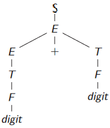
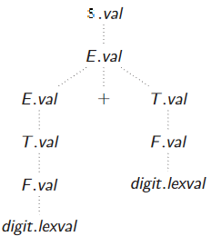
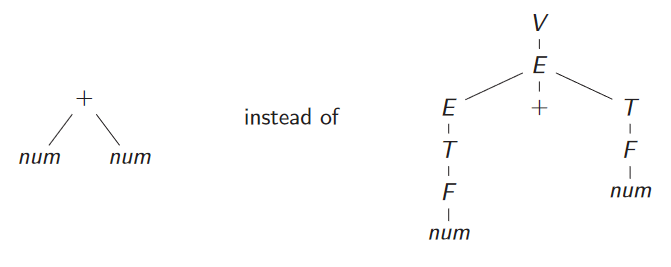
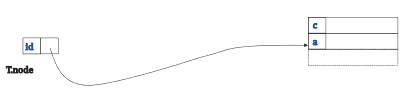
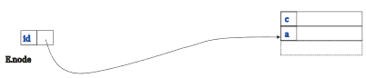
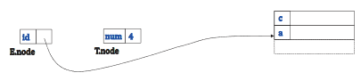
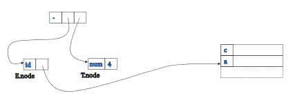
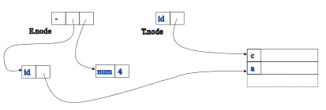
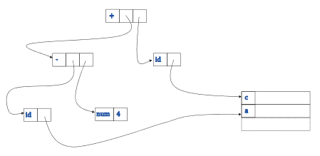

Calcoliamo informazioni aggiuntive una volta che la struttura sintatica è conosciuta, queste informazioni sono al di là delle capacità delle grammatiche *context-free*, diciamo "vanilla".
Tipicamente in questa fase:
* Popoliamo la tabella dei simboli (*symbol table*) dopo ogni dichiarazione.
* Facciamo dell'inferenza sui tipi e dei controlli su di essi nelle espressisoni e dichiarazioni.
Questo tipo di analisi si divide in due categorie:
* Analisi richiesta per stabilire la correttezza
* Analisi per aumentare l'efficenza del programma tradotto.
Il modo più semplice per implementare l'analisi semantica è identificare proprietà (attributi) di un simbolo della grammatica, e scrivere delle regole (regole semantiche) per descrivere come calcolare proprietà legate alle produzioni della grammatica.
L'insieme dato da (attributi, regole, ecc....) viene detto grammatica attribuita o *syntax-directed definition*.
Come struttura la scelta ottimale ricade su un *abstract syntax tree* che risulta essere una rappresentazione compressa di un *derivation tree*.
## Syntax-Directed Definitions
Introduciamo ora meglio il concetto di grammatica attribuita (Syntax-Directed Definitions) per gli amici *SDD*.
Sono delle grammatiche *context-free* arricchite con attributi e regole:
* **Attributi:** associti con dei simboli della grammatica, possono essere tipi, numeri, riferimenti alla tabella dei simboli ecc....
* **Regole semantiche:** associate con ogni produzione, tipicamente regolano il calcolo di attributi in funzione di attributi degli altri simboli della produzione.
Sia i simboli che le regole sono usati per dare senso (con l'analisi semantica) a quello che è espresso come un flusso di token.
## Tipi di attributi
Gli attributi dei non-terminali sono suddivisi in due categorie:
* **Sintetizzati:** gli attributi del driver sono definiti come una funzione degli attributi dei simboli della produzione.
* **Ereditati:** gli attributi dei non-terminali nel body sono definiti come funzione degli attributi dei simboli della produzione. 
Gli attributi dei terminali posso essere solo sintetizzati poichè forniti dall'analizzatore lessicale e non esiste regola per calcolarli.
### Esempio
Prendiamo la nostra grammatica per le espressioni aritmetiche e proviamo a scrivere delle regole e degli attributi per essa.
$$\mathcal{G} : \begin{cases} S \to E \\ E \to E+T | T \\ T \to T*F | F \\ F \to (E) | digit \end{cases}$$
Consideriamo ora il *parse tree* SLR(1), e diciamo che se un *digit* ha valore 3 e l'altro 4 il risultato deve essere 7.

Vediamo quindi che forma deve avere il suo *SDD* per poter computare il valore finale in $S$.
$$S \to E \hspace{2em} \{S.val = E.val\}$$
$$E \to E_1 + T \hspace{2em} \{E.val = E_1.val + T.val\}$$
$$E \to T \hspace{2em} \{E.val = T.val\}$$
$$T \to T_1 ∗ F \hspace{2em} \{T.val = T_1.val * F.val\}$$
$$T \to F \hspace{2em} \{T.val = F.val\}$$
$$F \to (E) \hspace{2em} \{F .val = E .val\}$$
$$F \to digit \hspace{2em} \{F.val = digit.lexval\}$$
Ora le regole sembrano abbastanza semplici e non necessitano di ulteriori spiegazioni tranne per un paio di appunti:
* La prima produzione $S \to E$ è una produzione aggiuntiva non necessria alla grammatica in se.
* Usiamo i numeri a pedice per differenziare lo stesso non-terminale nella stessa produzione.
* $digit.lexval$ è il valore che viene trovato nella tabella dei simboli.
L'*abstract syntax tree* risulta quindi in:

## Valutazione in ordine di un SDD
Non è sempre possibile che un SDD possa essere valutato, quindi definiamo un grafo (orientato) delle dipendenze per il nostro SDD e verifichiamo che non ci siano conflitti.
* Impostare un nodo del grafo delle dipendenze per ogni attributo associato con ogni nodo del *parse tree*.
* Per ogni attributo $X.x$ usato per definire l'attributo $Y.y$ creiamo un arco dal nodo di $X.x$ al nodo di $Y.y$.
Una volta creato il grafo delle dipendenze dobbiamo trovare un ordinamento topologico per il grafo, se l'ordinamento non esiste allora l'*SDD* non è valutabile.
Se invece un ordinamento esiste allora possiamo valutare l'*SDD* e abbiamo trovato anche un ordine in cui farlo.
Quando un *SDD* ha sia attributi ereditati che sintetizzati non ci sono garanzie che esista un ordinamento topologico, infatti potrebbe esserci un ciclo all'interno del grafo quindi nessun sorting è possibile.
$$A \to B \hspace{2em} \{ A.s = B.i; \hspace{0.5em} B.i=A.s+7 \}$$
In questo caso l'attributo sintetizzato di $A$ ha bisogno dell'attributo ereditato di $B$ e viceversa.
Esistono due classi di *SDD* per le quali è garantita l'esistenza di un ordinamento topologico.
1. **S-attributed SDDs:** ci sono solo attributi sintetizzati quindi ci basta fare una visita in post-ordine.
2. **L-attributed SDDs:** attributi sia sintetizzati sia ereditati tali che:
	* Per ogni produzione $A \to X_1 \cdots X_n$ la definizione di ogni $X_j.i$ usa al più:
		* Attributi ereditati da $A$ oppure
		* Attributi ereditati o sintetizzati dai fratelli a sinistra, ovvero $X_1, \dots, X_{j-1}$
Gli *SDD* S-attribuiti sono ideali per il parsing bottom-up perchè l'albero può essere valutato mentre si fa il parsing.
Gli L-attribuiti sono convenienti con il paring top-down perchè ho attributi ereditato solo da sinistra e nel parsing top-down faccio derivazioni leftmost quindi ez.
### Esempio
Prendiamo la grammatica LL(1) per le operazioni aritmetiche:
$$\begin{cases} V \to E \\ E \to TE^\prime \\ E^\prime \to +TE\prime|\varepsilon \\ T \to FT^\prime \\ T^\prime \to *FT^\prime|\varepsilon \\ F \to (E)|digit \end{cases}$$
Facciamo il parsing di $3*5$, come si vede partiamo da $V \implies E \implies TE^\prime$, ora la Quaglia ha disegnato solo il sottoalbero che ha come radice $T$ visto che dobbiamo $E^\prime \implies \varepsilon$.
Essendo un parsing top-down utilizziamo un albero L-attribuito:

-parsing-tree.png)

Ogni .s sta per attributi sintetizzato mentre ogni .i sta per ereditato.
Iniziamo quindi con il dare le regole alle varie produzioni:
* Prima di tutto possiamo notare che quando $T^\prime$ vieme copiato in $T$ si ha già il valore della moltiplicazione.
  $$T \to FT^\prime \hspace{2em} \{T^\prime .i = F.s; \hspace{0.5em} T.s = T^\prime .s \}$$
  Quindi passiamo $T^\prime$ come valore ereditato $F.s$ e assegniamo a $T$ sintetizzato il valore di $T^\prime .s$.
  -parsing-tree-pt2.png)
  
* Ora concentriamoci nelle produzioni di $T^\prime$, nel nostro caso abbiamo una moltiplicazione, quindi sappiamo che in $T^\prime .i$ è memorizato il valore del membro di sinistra per cui assegniamo a $T^\prime_1.i$ il valore della moltiplicazione.
  Dopodichè per poter risalire l'albero fino alla radice assegniamo a $T^\prime .s$ il valore del risultato finale del ramo destro che sarà memorizzato in $T^\prime_1 .s$.
  $$T^\prime \to *FT^\prime_1 \hspace{2em} \{ T^\prime_1 .i = F.s * T^\prime .i; \hspace{0.5em} T^\prime .s = T^\prime_1 .s \}$$
  -parsing-tree-pt3.png)
## Valutazione durante il parsing bottom-up
Il nostro obbiettivo è implementare la traduzione della parola durante il processo di parsing anzichè ottere il parsing tree poi annotarlo poi valutarlo.
Il caso più semplice in cui questa elaborazione può essere fatta è durante l'algoritmo shift/reduce con un *SDD* S-attribuito.
L'idea è quella di tenere oltre ai due stack per gli stati *stSt* e per i simboli *symSt* un ulteriore stack per gli attributi *semSt*.
Ogni volta che faccio una uno shift (leggo una valore) faccio un push della prima istruzione e.g. `push digit.lexval` e ogni volta che faccio una riduzione faccio il `pop` dei valori nel body e poi il `push` del valore del driver.
### Caso studio
Pensiamo di dover tradurre un numero inserito come stringa in un intero base 10.
Una grammatica LALR(1) molto semplice potrebbe esssere :
$$S \to Digits \hspace{2em} \{print(D.val)\}$$
$$Digits \to Digits_1 d \hspace{2em} \{Digits.val = Digits_1.val*10+d.lexval\}$$
$$Digits \to d \hspace {2em} \{Digits.val = d.lexval\}$$
Notiamo che l'*SDD* è S-attribuito quindi l'albero è valutabile e siamo apposto.
Aggiungiamo ora un livello di difficoltà, diciamo che se la stringa è preceduta dal terminale $o$ allora dobbiamo tradurre il numero in base 8. (La Quaglia ha un concetto strano di base 8)
Praticamente se abbiamo la $o$ dobbiamo moltiplicare per 8.
Andiamo a tentativi pe vedere di trovare uina grammatica buona.
1. $$\begin{cases} S \to Num \\ Num \to o\ Digits | Digits \\ Digits \to Digits\ d | d \end{cases}$$
   Per essere sicuri di poter valutare l'albero gli attributi devono essere sintetizzati.
   Ma in questo caso non è possibile perchè noi prima facciamo prima una riduzione $Digits \to d$ e poi tutte le riduzioni $Digits \to Digist\ d$, quindi non sappiamo ancora fino all'ultima riduzione $Num \to o\ Digits | Digits$ la base in cui convertire, unlucky.
2. Proviamo con la grammtica:
   $$\begin{cases} S \to Num & \{print(Num.v)\} \\ Num \to oO & \{Num.v = O.v\} \\ Num \to D & \{Num.v = D.v\} \\ O \to O_1 d & \{O.v = O_1.v * 8 + d.lexval\} \\ O \to d & \{O.v = d.lexval\} \\ D \to D_1 d & \{D.v = D_1.v ∗ 10 + d.lexval\} \\ D \to d & \{D.v = d.lexval\} \end{cases}$$
   Buona per attributi sintetizzati e LALR(1) ma c'è troppa ridondanza.
3. Proviamo quindi a sfoltire un po' la grammatica:
   $$\begin{cases} S \to Num & \{print(Num.v)\} \\ Num \to Octal\ Digits & \{Num.v = Digits.v\} \\ Num \to Decimal\ Digits & \{Num.v = Digits.v\} \\ Octal \to o & \{base = 8\} \\ Decimal \to \varepsilon & \{base = 10\} \\ Digits \to Digits_1\ d & \{D.v = D1.v * base + d.lexval\} \\ Digits \to d & \{Digits.v = d.lexval\} \end{cases}$$
   Abbiamo anora margine di miglioramento perchè stiamo usando una variabile globale `base`, come in programmazione usiamo il meno possibile delle variabili globali.
4. Proviamo quindi a unire il terminale che gestisce le basi, così che ne venga subito fatta una riduzione.
   $$\begin{cases}S \to D & \{print(D.v)\} \\ D \to D_1\ d & \{D.v = D1.v * D_1.base + d.lexval; \hspace{0.5em} D.base = D_1.base\} \\ D \to B\ d & \{D.v = d.lexval; \hspace{0.5em} D.base = B.val\} \\ B \to o & \{B.val = 8\} \\ B \to \varepsilon & \{B.val = 10\} \end{cases}$$
   questo sembra un buon compromesso perchè se parsiamo la stringa $o d d$ la prima cosa che facciamo è leggere $o$ e ridurlo in $B$ quindi sappiamo la bae, se invece abbiamo una parola tipo $d d$ vuol dire che faremo la riduzione $B \to \varepsilon$ e quindi sappiamo che la base è 10.
# Abstract syntax trees
Una rappresentazione più compatta del *parse tree*, spesso usato come rappresentazione intermedia.
Non esistono regole generali per costruirli ma dipende tutto dalla grammatica che andiamo ad analizzare e dalle scelte implementative.
Devono contenere tutte le informazioni per portare avanti l'analisi.

D'ora in poi per semplicità li chiameremo *AST*.
## Memorizzazione di un AST
Di fatto stiamo andando a creare in memoria un albero nel quale ogni nodo è un passaggio intermedio del processo di analisi di una parola.
I nodi dell'*AST* sono così strutturati:
* **Foglie:** contengono dei link alla tabella dei simboli, viene creata una foglia per ogni valore diretto (e.g. valore numero) trovato nella parola.
* **Nodi:** sono la struttura dell'albero e rappresentano i passaggi effetuati.
## Creazione di un AST
Potremmo crearlo dopo aver trovato il *parse tree*, ma il nostro obbiettivo è faro mentre leggiamo la parola quindi durante il parsing.
Dobbiamo avere una grammatica S-attribuita per poterlo fare durante l'analisi sintattica (parsing).
Facciamo un paio di assunzioni su 2 funzioni a nostra disposizione:
* `newLeaf(label, val)` crea una nuova foglia con due campi, la label del nodo e il valore.
* `newNode(label, c1,....,ck)` crea un nodo interno che può avere fino a k figli, label è l'identificatore del nodo mentre i successivi argomenti sono riferimenti ai figli.
## Esempio
Prendiamo la grammatica LALR(1) delle espressioni aritmetiche:
$$\begin{cases} E \to E_1+T & \{E.node = newNode('+', E_1.node, T.node)\} \\ E \to E_1-T & \{E.node = newNode('+', E_1.node, T.node)\} \\ E \to T & \{E.node = T.node\} \\ T \to (E) & \{T.node = E.node\} \\ T \to id & \{T.node = newLeaf(id,id.entry)\}\\ T \to num & \{T.node = newLeaf(num,num.lexval)\}\end{cases}$$
Ora proviamo a fare il parsing del lessema $a-4+c$ che risulta essere $id-num+id$.
Essendo noi dei parser umani possiamo fare le riduzioni a occhio senza la tabella di parsing:
1. $T \to id$
2. $E \to T$
3. $T \to num$
4. $E \to E-T$
5. $T \to id$
6. $E \to E+T$
Ora vediamo graficamente le regole eseguite ogni riduzione:
1. $T \to id \hspace{2em} \{T.node = newLeaf(id,id.entry)\}$
   
   
2. $E \to T \hspace{2em} \{E.node = T.node\}$
   
   
3. $T \to num \hspace{2em} \{T.node = newLeaf(num, num.lexval)\}$
   
   
4. $E \to E_1-T \hspace{2em} \{E.node = newNode('−', E_1.node,T.node)\}$
   
   
5. $T \to id \hspace{2em} \{T.node = newLeaf(id,id.entry)\}$
   

6. $E \to E_1+T \hspace{2em} \{E.node = newNode('+', E_1.node, T.node)\}$
   

## Abstract syntax trees per LL(1)
Dovendo fare un parsing top-down ci conviene usare una grammatica L-attribuita, quindi possiamo avere attributi ereditati, come facciamo a costruire un *AST* per loro?
Dobbiamo passare riferimenti ai nodi anxichè valori e fare il giro lungo, ovvero produrre il *parse tree* annotato poi definire un grafo delle dipendeze ed infine costruire l'*AST*.
### Esempio
$$\begin{cases} E \to TE' & \{E .node = E'.node; \hspace{0.5em} E'.i = T .node\} \\ E' \to +TE'_1 & \{E'.node = E'_1.node; \hspace{0.5em} E'_1.i = newNode('+', E'.i, T .node)\} \\ E' \to -TE'_1 & \{E'.node = E'_1.node; \hspace{0.5em} E'_1.i = newNode('-', E'.i, T .node)\}\\ E' \to \varepsilon & \{E'.node = E'.i\} \\ T \to (E) & \{T .node = E .node\} \\ T \to id & \{T .node = newLeaf(id, id.entry )\} \\ T \to num & \{T .node = newLeaf (num, num.lexval)\} \end{cases}$$

Proviamo quindi a fare il parsing del lessema $a - 4$ ovvero $id - num$.
Eseendo un parsing top-down con derivazioni leftmost le derivazioni saranno:
$$E \implies TE^\prime \implies id E^\prime \implies id - TE^\prime \implies id - num E^\prime \implies id - num$$
L'ordinamento topologico ci restituirà il seguente ordine di valutazione:
//Nei passaggi successivi creeremo dei nodi in seguito ci riferiremo agli stessi nodi con le loro *label*

-ex.png)

1. id.entry (riferimento alla entry di $a$ nella *symbol table*)
2. $T.node = newLeaf(2,id.entry)$
vado in $E^\prime$ e valuto quello che sta sotto
3. $num.lexval = 4$
4. $T.node = newLeaf(4,num.lexval)$
5. Sfruttiamo $E^\prime.i = T.node = 2$ della produzione $E \to TE^\prime$ per portarci il numero contenuti in $id$.
6. Ora possiamo scendere in con $E'_1.i = newNode('-', 2, 4)$ nel punto 6.
7. Fortunatamente abbiamo una produzione che va in $\varepsilon$ quindi creaiamo un riferiemento al nodo della sottrazione con $E^\prime.node = E^\prime.i$
8. Creiamo un altro riferimento al nodo della sottrazione con $E^\prime.node = E^\prime_1.node$ della produzione $E^\prime \to -TE^\prime_1$
9. Finico di risalire l'albero creando un riferimento allo stesso nodo con $E.node = E^\prime.node$ della prima produzione.