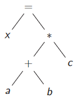
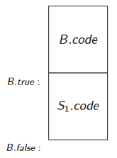

Ripercorriamo un istante tutte le fasi di front-end che abbiamo visto fino ad ora:
* **Analisi lessicale:** riconosce i vari lessemi e restituire una stringa i token ovvero quegli elementi di cui ha bisogno l'analizzatore sintattico.
* **Anlisi sintattica:** tutto il parsing, quindi veere o meno se una serie di token appartiene o meno al linguaggio di nostra comeptenza.
* **Analisi semantica:** compie controlli statici sulla compatibilità tra operatori e operandi come la validità delle istruzioni di controllo e condizionali come `if` e `while`.
* **Generazione di codice intermedio:** che vedremmo ora
E' possibile implemenatre l'analisi semantica durante l'analisi sintattica, ma questa agglomerazione è possibile anche con la generazione di codice intermedio che può essere fatta durante il parsing.
# Codice intermedio
E' il passo intermedio tra il nostro codice ed il codice macchina, rende più leggibile il codice macchina avvicinandosi molto.
E.g. nasconde le specifiche come il movimento di valori tra registri e memoria.
## Rappresentazione intermedia
Abbiamo più di una possibilità per poter vedere il codice intermedio, ma 3 sono le maggiori:
1. **Struttura a grafo:** partendo dai *parse tree* possiamo avere delle strutture a grafi come gli *AST* oppure un grafo diretto aciclico *DAG*, solitamente i *DAG* risultano più succinti degli *AST*.
2. **Codice a 3 indirizzi:** impedisce direferenziare più di tre avlori per ogni singolo statement riduce di molto la complessità degli statement stessi, genera codice della forma `x = y op z`.
   Noi useremo questa alternativa.
3. **Altro linguaggio:** utilizzare un altro linguaggio di programmazione, questo approccio ci salva dal dover implemenatre da 0 un back-end per il compilatore.
   La scelta preferita da molti è `C` per il suo compilatore estremamente efficente.
## Codice a 3 indirzzi
E' la rappresentazione testuale di un *AST*, come al solito un esempio vale più di mille parole.
Prendiamo l'*abstract syntax tree* che rappresenta una semplice espressione aritmetica.

L'espressione risulta essere `x = a + b * c`, con precedenza all'addizione.
Come possiamo però vedere stiamo usndo 4 riferimenti nello statement, dobbiamo quindi spezzarli:
````
t1 = a + b
t2 = t1 * c
x = t2
````
Abbiamo a disposizione una grande varietà di istruzioni:
* `a1 = a2 op a3`
* `a1 = op a2` 
* `a1 = a2`
* `a1 = a2[a3]`
* `a1[a2] = a3`
* `goto L`
* `if a goto L`
* .......
Però la rappresentazione in modo testuale a 3 indirzzi ci facilita molto la generazione e l'ottimizzazione del codice macchina, tuttavia non è una tecnica così utilizzata perchè è troppo *machine dependent*.
## Codice intermedio
Supponiamo di avere un espressione del tipo:
````
if ( x < 100 || x > 200 && x != y ) x=0;
````
Una sua prima trasfornmazione in codice intermedio potrebbe essere:
````
	IF x < 100 GOTO L2
	GOTO L3
L3: IF x > 200 GOTO L4
	GOTO L1
L4: IF x != y GOTO L2
	GOTO L1
L2: x = 0
L1:
````
Però questo codice può essere ottimizzato, ovvero possiamo notare che controllando la falsità di alcuni statement possiamo eliminare dei GOTO ridondanti.
````
	IF x < 100 GOTO L2
	IF x <= 200 GOTO L1
	IF x == y GOTO L1
L2: x = 0
L1:
````
### Traduzione guidata da sinstassi
Possiamo quindi tradurre un *AST* in una serie di istruzioni a 3 operatori, come?
Prendiamo in esame la seguente grammatica:
$$\begin{cases} S \to id = E \\ E \to E_1+E_2 \\ E \to -E_1 \\ E \to (E_1) \\ E \to id \end{cases}$$
l'obbiettivo è di produrre del codice a 3 indirizzi con l'utilizzo di attributi e funzioni ausiliri:
* `E.addr`l'indirzzo di memoria in cui c'è il valore di `E`
* `S.code` e `E.code` indicano il codice emesso da `S `e `E`
* `gen(str)` emette la strimga `str`
* `newtemp()` genera un nuovo nodo
* `⊳` questo simbolo indica la concatenazione tra frammenti di codice intermedio
Quindi possiamo arricchire la grammatica che sta sopra con:
````
S -> id = E  S.code = E .code ⊳ gen(table.get(id) '=' E .addr)  
E -> E1 + E2  E .addr = newtemp()  
			  E .code = E1.code ⊳ E2.code ⊳ gen(E .addr '=' E1.addr '+' E2.addr)
E -> -E1  E.addr = newtemp()
		  E.code = E1.code ⊳ gen(E.addr '=' '-' E1.addr)
E -> (E1)  E.addr = E1.addr
		   E.code = E1.code
E -> id  E.addr = table.get(id)
		 E.code = ''
````
## Statement di controllo di flusso
Prendiamo una possibile grammatica come :
$$\begin{cases} P \to S \\ S \to if(B)\ S_1 \\ S \to if(B)\ S_1\ else\ S_2 \\ S \to while(B)\ S_1 \\ \vdots \\ B \to true \\ B \to false \\ B \to B_1 || B_2 \\ B \to B_1 \&\& B_2\end{cases}$$
Il nostro cruccio è capire come vengono tradotti quei salti dati dalle istruzioni condizionate.
Osservando un blocco `if-then` ci accorgiamo che la sua struttura potrebbe essere:



Dove l'etichetta `B.true` punta alla prima istruzione a eseguire se la condizione è vera mentre `B.false` punta alla prima istruzione dopo la chiusura del blocco `then`.
Per poter implementare questi salti ci servono degli attributi per poter fare dei salti, ovviamente questi attributi possono essere sia ereditati che sintetizzati:
* `S.next`, ereditato, indica la prima istruzione da eseguire terminato il blocco di codice `S`.
* `S.code`, sintetizzato, è la sequenza di codice intermedio che implemeneta lo stato `S` e termina con un salto a `S.next`.
* `B.true`, ereditato, indica l'inizio del codice che va eseguito se `B` è `true`.
* `B.false`, ereditato, indica l'inizio del codice da eseguire se `B` è `false`.
* `B.code`, ereditato, è la sequenza i codice intermedio che implementano la condizione `B` e fanno il salto alle label `B.true` oppure `B.false`.
**N.B:** i booleani possono avere due ruoli diversi:
1. Alterare il flusso del programma con condizioni booleane.
2. Calcolare il valore di espressioni logiche.
Noi consideriamo solo il loro primo utilizzo, ovvero quello per il controllo di flusso, perchè per il loro secondo ruolo i booleani si comportano esattamente come operatori aritmetici (con le loro regole ecc...).
Spesso le grammatiche hanno non-terminali diversi per distinguere i booleani nelle condizioni e nelle espressioni logiche.
### Esempio
Andiamo a prendere la prima produzione della nostra grammatica, ovvero $P \to S$ la sitassi del suo codice intermedio sarà più o meno:
$$P \to S \hspace{2em} \{S.next = newlabel(); \hspace{0.5em} P.code = S.code ⊳ label(S.next) \}$$
Quindi il nostro programma $P$ può essere visto come un enorme statement $S$.
Vediamo quindi le nuove funzioni usate:
* `newlabel():` una volta invocata genera una nuova etichetta.
* `label(L):` assegna l'etichetta $L$ alla prossima istruzione a 3 indirizzi generata.
Solitamente nei frammenti dove si fa uso dei salti condizionati dioventa imperatico l'uso del comando `GOTO` per saltare ad una determinata label.
Quindi adesso vediamo come verrebbe arricchita quella grammatica dalle istruzioni di generazione di codice intermedio.
````
P -> S  S.next = newlabel()
		P.code = S.code ⊳ label(S.next)
S -> if(B) S1  B.true = newlabel()
				B.false = S.next
				S1.next = S.next
				S.code = B.code ⊳ label(B.true) ⊳ S1.code
S -> if(B) S1 else S2  B.false = newlabel()
						B.true = newlabel()
						S1.next = S.next
						S2.next = S.next
						S.code = B.code ⊳ lable(B.true) ⊳
							S1.code ⊳ gen(GOTO S.next) ⊳ 
							label(B.false) ⊳ S2.code
S -> while(B) S1  B.true = newlabel()
					B.false = S.next
					S1.next = newlabel()
					S.code = label(S1.next) ⊳ B.code ⊳
						label(B.true) ⊳ S1.code ⊳
						gen(GOTO S1.next)
B -> true  B.code = gen(GOTO B.true)
B -> false  B.code = gen(GOTO B.false)
B -> not B1  B1.true = B.false
				B1.false = B.true
				B.code = B1.code
B -> E1 rel E2  B.code = E1.code ⊳ E2.code ⊳  
				gen(IF E1.addr relop E2.addr GOTO B.true) ⊳
				gen(GOTO B.false)
B -> B1 || B2  B1.true = B.true
				B1.false = newlabel()
				B2.true = B.true
				B2.false = B.false
				B.code = B1.code ⊳ label(B1.false) ⊳ B2.code
B -> B1 && B2  B1.true = newlabel()
				B1.false = B.false
				B2.true = B.true
				B2.false = B.false
				B.code = B1.code ⊳ lable(B1.true) ⊳ B2.code
````
Procediamo all'analisi blocco per blocco.
#### Blocco `if-then`
Per prima cosa creiamo un'etichetta alla quale puntare se `B` risultui vero, invece se `B` dovesse risultare falsa possiamo saltare per intero lo statement `S1` e quindi per via dell'assenza di un `else` saltare subito a `S.next`.
Quindi nel complesso il valore da dare al nostro statement `S` è composto da il codice per interpretare `B`, la label alla quale saltare se `B` è vero ed infine il codice situato in questa label.
#### Blocco `if-the-else`
Eleviamo ora il caso precedente al caso in cui ci sia anche un blocco `else`.
Creiamo le due label in caso `B` sia o vero o falso e puntiamo il successivo dei due micro-statement al successivo dello statement nel driver della produzione.
Ora assembliamo tutto e otteniamo il codice di calcolo di `B` se è vero saltiamo al codice di `S1` per poi fare un `GOTO S.next` se invece è falso facciamo un salto a `S2.code` ed eseguiamo il codice. 
#### Ciclo `while`
Potremmo vederlo come un blocco `if-then` che si ripete più volte, infatti per `B.true` generiamo una nuova label, mentre per `B.false` andiamo al prossimo statement.
Il successivo dello statement interno viene identificato a una nuova label che punterà poi all'inizio del ciclo.
Nel comlpessivo il codice di `S` è la creazione della label per `S1.next`, il codice per computare `B`, se è vera eseguo `S1.code` e salto a `S1.next` quindi riparto dall'inizio e rifaccio il controllo su `B`, se è `true` ripeto il ciclo altrimenti vado a `S.next`.
#### Operazioni booleane
Occhio, qui si compie **SMART EVALUATION** non lazy come molti lazzaroni dicono, se all'orale dite lazy penso che la Quaglia vi fulmini.
Partiamo con l'`OR`, basta che il primo elemento sia vero, quindi se `B1` è vero punteremo a `B.next` mentre se è falso ad una nuova label, per quanto riguarda `B2` se è vero punteremo a `B.true` mentre se è falso a `B.false`, questo perchè è l'ultima espressione da analizzare e il suo valore determinerà quello dell'espressione.
Quindi il codice dell'espressione sarà il codice per calcolare `B1` seguito dalla label se `B1` è `false` e quindi dal codice per computare `B2`.
Bene, ora per l'`AND` vale tutto quello appena detto ma semi-specchiato perchè devono essere veri entrambi gli elementi.
### Evitare `GOTO` ridondanti
Dobbiamo ipotizzare che se la condizione booleana risulta vera dobbiamo eseguire l'istruzione prossima in sequenza (quindi nella riga sottostante).
Creiamo quindi una nuova keyword per indicare di non fare un `GOTO` ad una label specifica bensì di eseguire l'istruzione successiva, questa keyword sarà `fall`.
Facciamo un po' di esempi con la grammatica precedente.
````
P -> S  S.next = newlabel()
		P.code = S.code ⊳ lable(S.next)
S -> if(B) S1  B.true = fall
				B.false = S.next
				S1.next = S.next
				S.code = B.code ⊳ S1.code
S -> while(B) S1  B.true = fall
					B.false = s.next
					S1.next = newlabel()
					S.code = label(S1.next) ⊳ B.code ⊳
						S1.code ⊳ gen(GOTO S1.next)
B -> true  if B.true != fall then gen(GOTO B.true)  
B -> false  gen(GOTO B.false)

ecc.....
````
### Non fare 2 passate: Backpatching
Prendiamo in esame la seguente produzione
````
S -> if(B) S1  B.true = fall
				B.false = S.next
				S1.next = S.next
				S.code = B.code ⊳ S1.code
````
Quando il codice per `B` è generato non conosciamo ancora `S.next` quindi sarebbero necessarie due passate, una per generare il codice ed un'altra per poter inserire le destinazioni dei salti.
Per fortuna la Prof. ci ha svelato una strategia che ci farà dire "abbiamo vinto".
Per poter applicare la strategia del *backpatching* dobbiamo assumere che le istruzioni siano generate in un array e le label indichino defli indiuci per accedere all'array.
Consideriamo i seguenti attributi:
* `B.truelist` attributo sintetizzato in cui c'è la lista dei salti in cui dobbiamo inserire una label se `B` risulta `true`.
* `B.falselist` attributo sintetizzato in cui c'è la lista dei salti in cui dobbiamo inserire una label se `B` risulta `false`.
* `nextinstruction` contiene l'indice dell'istruzione successiva.
* `makelist(i)` crea una lista contenente l'indice `i`, restituisce il puntatore a quella lista.
* `merge(p1, p2)` concatena le liste `p1` e `p2`, restituisce il puntatore alla lista creata.
* `backpatch(p, i)` inserisce la label `i` in tutti i salti incompleti contenuti nella lista `p`.
Generiamo salti incompleti quindi della forma `GOTO _` , per esempio:
````
S -> if(B) M S1  backpatch(B.truelist, M.instr)
					S.nextlist = merge(B.falselist, S1.nextlist)
````
Dove il nuovo non-terminale `M` serve a puntare alla prossima istruzione.
````
M -> ε  M.instr = nextinstr
````
#### Esempio
Prendiamo in esame la nostra grammatica delle espressioni booleane.
````
M -> ε  M.instr = nextinstr
B -> true  B.truelist = makelist(nextinstr)
			gen(GOTO _)
B -> false  B.falselist = makelist(nextinstr)
			gen(GOTO _)
B -> not B1  B.truelist = B1.falselist
				B.falselist = truelist
B -> E1 rel E2  B.truelist = makelist(nextinstr)
				B.falselist = makelist(nextinstr+1)
				gen(IF E1.addr relop E2.addr GOTO _)
				GEN(GOTO _)
B -> B1 || M B2  backpatch(B1.falselist, M.instr)
				B.truelist = merge(B1.truelist, B2.truelist)
				B.falselist = B2.falselist
B -> B1 && M B2  backpatch(B1.truelist, M.instr)
					B.truelist = B2.truelist
					B.falselist = merge(B1.falselist, B2.falselist)
S -> if(B) M S1  backpatch(B.truelist, M.instr)
					S.nextlist = merge(B.falselist, S1.nextlist)
S -> while M1 (B) M2 S1  backpatch(S1.nextlist, M1.instr)
							backpatch(B.truelist, M2.instr)
							S.next = B.falselist
							gen(GOTO M1.instr)
````
### Indirizzamento degli elementi di un array
Il più grande problema con la gestione dei vettori mono/bi dimensionali (vedremo solo questi per semplicità) è il calcolo degli indirizzi dei loro elementi, dobbiamo tenere a mente che sono aree di memoria contigue.
Esistono due strategie principali per la memorizzazione degli array:
* *Row-major:* il modo più diffuso nonchè quello che utilizzeremo noi, consiste nel far variare il secondo indice (nel caso di una matrice) perchè viene memorizzato tutto dando precedenza alle righe, infatti in una matriche $M$ di dimensioni $2 \times 4$ gli elemnti sono nel seguiente ordine ordine $M[0][0]$, $M[0][1]$, $M[0][2]$, $M[0][3]$, $M[1][0]$, $M[1][1]$, $M[1][2]$ e $M[1][3]$.
* *Colum-major:* cambia l'indice più a sinistra e si percorre colonna per colonna, quindi in una matriche $M$ di dimensioni $2 \times 4$ gli elemnti sono nel seguiente ordine ordine $M[0][0]$, $M[1][0]$, $M[0][1]$, $M[1][1]$, $M[0][2]$, $M[1][2]$, $\dots$
Se gli elementi immagazzinati in un array **monodimensionale** sono $0,1,\dots , n$ allora possiamo facilmente calcolare l'indirro dell'i-esimo elemento, basta sapere l'indirzzo del primo elemento detto $base$ e la lunghezza di ogni elemento detta $w$:
$$address\ of\ M[i] = base+(i*w)$$
Se invece parliamo di un array **bidimensionali** dobbiamo anche conoscere la lunghezza di uin'inter riga $w_1$ allor l'indirizzo è calcolabile come:
$$address\ of\ M[i][j] = base + (i*w_1) + (j*w)$$
#### Traduzione *syntax-directed* di un array
Prendiamo una grammatica che generi vettori a $n$ dimensioni
$$\begin{cases} S \to id = E \ | \ L = E \\ E \to E+E \ | \ id \ | \ L \\ L \to id[E] \ | \ L[E] \end{cases}$$
Dobbiamo usare i seguenti attributi:
* `L.addr` indica una variabile temporanea per computare l'offset.
* `L.array` è il riferimento alla entry nella tabella dei simboli che contiene il nome dell'array, la entry contiene anche varie info:
	* L'indirzzo base dell'array `L.array_base`
	* La larghezza di ogni elemento `L-array_ewidth`
* `L.width` la larghezza del sotto-array generato da `L`
Vediamo ora produzione per produzione
````
S -> L = E  gen(L.array_base '[' L.addr ']' '=' E.addr)
E -> L  E.addr = newtemp()
		gen(E.addr '=' L.array_base '[' L.addr ']')
L -> id[E]  L.array = table.get(id)
			L.width = L.array_ewidth
			L.addr = newtemp()
			gen(L.addr '=' E.addr '*' L.width)
L -> L1[E]  L.array = L1.array
			L.width = L1.width
			L.addr = newtemp()
			t = newtemp()
			gen(t '=' E.addr '*' L.width)
			gen(L.addr '=' L1.addr '+' t)
````
