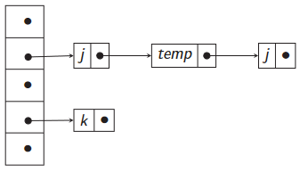
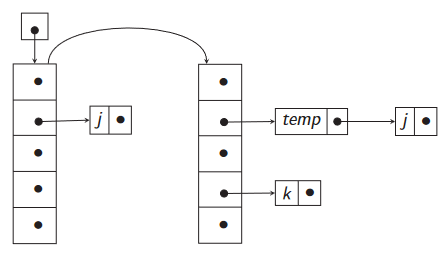

# 08-interpreter
## Symbol table
Questa è la struttura dati più importante durante la compilazione dopo il *syntax tree*.  
Tipicamente è implementata attraverso un dizionario e risulta fondamentale quando entrano in gioco attributi ereditati perchè su di essa vengono effettuate le operazioni di:
* `insert`, inserimento di un nuovo elemento
* `lookup` ricerca di un elemento
* `delete` rimozione di un elemento
Visti i tipi di operazione da eseguire la struttura dati ottimale da usare risulta essere la `Hash table` perchè posso eseguire tutte le funzioni in tempo costante.
### Risoluzione collisioni
#### Open adressing
Ogni bucket ha abbastanza spazio per un singolo elemento, inseriamo l'item che collide nel bucket successivo.  
Quindi il contenuto della table è limitato alla dimensione dell'array dei buckets.  
Purtroppo questo metodo soffre di performance non proprio al top.
#### Separate chaining
Ogni bucket contiene una lista lineare infatti ogni item che collide viene inserito come nuovo item nella lista del bucket.
### Funzione di Hash
L'obbiettivo è convertire una stringa di caratteri (cioè il nome dell'identificatore) in un intero compreso tra 0 e $size-1$ dove $size$ è la dimensione dell'array che contiene i bucket.
1. Convertiamo ogni carattere in un intero non negativo tipicamente con meccanismi built-in del linguaggio in cui è implementato il compilatore.
2. Applichiamo una funzione di Hash $h$ adeguata, non vogliamo che nomi simili come tmp1, tmp2 collidano, quindi scorriamo tutta stringa.
3. Una buona scelta di funzione è $h = (\sum_{i=1}^{n}{\phi^{n-1}c_i})\ mod\ size$.
4. Dove $c_i$ è il valore numeri del i-esimo carattere e $\phi$ è una potenza di 2 quindi la moltiplicazione può essere uno shift.
### Scope
I vari nomi hanno una dichiarazione come può essere costante/variabile/funzione, e anche delle differenti tipologie di scope:
* **Dichiarazione locale:** i nomi hanno uno scope limitato quindi sono visibili solo in una porzione di codice.
* **Dichiarazione globale:** i nomi sono visibili in tutto il codice.
Lo stesso nome può avere più dichiarazioni, allora useremo quella più vicina al punto in cui ci troviamo.  
Possiamo immaginare le dichiarazioni come un *AST* nel quale le dichiarazioni annidate sono parte di sottoalberi dell'*AST* degli *AST* in cui è definita la variabile con lo stesso nome ma scope maggiore.  
Ma come va a gestire lo cope annidato la tabella dei simboli?  
Esistono due strategie principali.
1. **Stack like:** viene usata una lista per ogni bucket, l'elemento più recente è memorizzato prima,così da gestire la lista come una pila, questa strategia necessità di implemenetare un metodo che elimini le variabili una volta usciti dallo scope.
   
   
   
2. **New symbol table:** creiamo una nuova tabella dei simboli per ogni nuovo scope e la colleghiamo alla principale tramite puntatore, a quel punto basterà eliminare il puntatore una volta usciti dallo scope.
   
   

# Interpreti
Una volta che abbiamo un *AST* e una tabella dei simboli possiamo creare un interprete.  
Tipicamente l'interpete associa ad ogni non-terminale una funzione, queste funzioni tipicamente prendono in input l'*AST*, la tabella dei simboli ed altra roba.  
Queste funzioni possono essere scritte in ognit tipo di linguaggio eseguibile quindi sia linguaggio macchina sia un linguaggio ad alto livello compilato in linguaggio macchina.
## Esempio
La Quaglia ha detto "un semplice linguaggio funzionale", spoiler non è semplice.  
Vediamo adesso la grammatica di un linguaggio funzioanle molto ridotto, aggiungeremo poi tutte le funzioni che lo interpretano, eseendo un linguaggio funzionale può essere visto come una lista di funzioini, anche se dobbiamo fare delle assunzioni enunciate dopo.
$$\begin{cases} Program \to Funs \\ Funs \to Fun \\ Funs \to Fun\ Funs \\ Fun \to TypeId ( TypeIds ) = Exp \\ TypeId \to int\ id \\ TypeId \to bool\ id \\ TypeIds \to TypeId \\ TypeIds \to TypeId,\ TypeIds \\ Exp \to num \\ Exp \to id \\ Exp \to Exp + Exp \\ Exp \to Exp = Exp \\ Exp \to if\ Exp\ then\ Exp\ else\ Exp \\ Exp \to id (Exps) \\ Exp \to let\ id = Exp\ in\ Exp \\ Exps \to Exp \\ Exps \to Exp,\ Exps \end{cases}$$
Partiamo con le assunzioni:
* Nessuna funzione può essere risolta più di una volta.
* Esistono symbol table separate per funzioni `fatb` e variabili `vtab`.
* Il programma contiene una funzione `main` che ha com argomento un intero e ritorna un intero.
* L'esecuzione del programma inizia invocando il `main`.
Come i vede dalla grammtica una funzione `Fun` deve avere un nome e un tipo di ritorno `TypeId` una serie di argomenti `TypeIds` e un body con un'espressione `Exp`.  
Usiamo un approccio top-down quindi prima dichiariamo le funzioni che interpretrano serie di funzioni e poi quelle che interpretano funzioni singole.
````
eval_ExpS(ExpS, vatb, ftab) = case ExpS of
	Exp : [eval_Exp(Exp, vatb, ftab)]
	Exp, ExpS : eval_Exp(Exp, vtab, ftab) :: eval_Exps(Exps, ftab, vtab)
````
Come si vede per le espressioni singole si usa una funzione `eval_Exp` che noi dobbiamo ancora definire, ipotizzimo che essendo un linguaggio funzionale `::` serva a concatenare delle liste come in [SML](https://smlfamily.github.io/).  
Passiamo ora alla funzione `eval_Exp` ovvero la parte più corposa, dobbiamo fare alcune specifiche per poterla comprendere al meglio:
* La funzione `lookup` restitisce i valori che trova in una tabella dei simboli dato un nome, se quel nome non esiste all'interno della tabella dei simboli specificata alora viene ritornato un valore speciale detto `unbound`. 
* Esiste una funzione `eval_Fun` che compie la valutazione di una funzione dato il suo nome, gli argomenti e la tabella delle variabili.
* Esiste una funzione `insert` che inserisce all'interno di una tabella dei simboli una nuova tupla nome-valore e ritorna la tabella modificata. 
````
eval_Exp(Exp, vtab, ftab) = case Exp of
	num : num.lexval
	id : v = lookup(vtab, getname(id))
		 if v == unbound then error() else v
	.....
	id(ExpS) : def = lookup(ftab, getname(id))
				if def == unbound
				then error()
				else
					args = eval_ExpS(ExpS, ftab, vtab)
					eval_Fun(def, args, vtab)
	let id = Exp1 in Exp2 : v1 = eval_Exp(Exp1, vtab, ftab)  
							vtab' = insert(vtab, getname(id), v1)  
							eval_Exp(Exp2, vtab', ftab)
````
Piccola precisazione l'ultimo caso è molto particolare, in partica all'interno dello scope di `Exp2` assegno alla variabile `id` il valiore di `Exp1`.
### Chiamata di funzioni
Sempre all'interno dell'esempio dopo aver implemenatto la valutazione delle espressioni dobbiamo pensare a come valuitare le funzioni, dobbiamo seguire alcuni step:
* Controllare il numero degli argomenti.
* Controllare i tipi degli argomenti.
* Istanziare una tabella dei simboli per lo scope della funzione.
* Valutare il corpo della funzione con questa nuova tabella.
* Controllare se il tipo del risultato è uguale al tipo di ritorno dichiarato.
Usiamo sempre l'approccio top-down di prima.  
Iniziamo con la dichiarazione di `eval_Fun` che sarebbe la funzione che compie la valutazione in se
````
eval_Fun(Fun, args, ftab) = case Fun of
	TypeId(TypeIds) = Exp : (f, t0) = get_TypeId(TypeId)
							vtab = bind_TypeIds(TypeIds, args)
							v1 = eval_exp(Exp, vtable, ftable)
							if type(v1) == t0
								then v1
								else error
````
Ora, la prima funzione incognita che incontriamo è `get_TypeId` che ci deve restituire una tupla nome e tipo, in questo caso il nome della funzione ed il suo tipo di ritorno.  
Ricordando la produzione:
$$TypeId \to int\ id\ |\ bool\ id$$
andiamo a definire la funzione
````
get_TypeId(TypeId) = case TypeId of
	int id : (getname(id),int)
	bool id : (getname(id),bool)
````
La seconda funzione incognita è `bind_TypeIds` che non fa altro che controllare se i tipi dichiarati degli argomenti sono gli stessi dei tipi inseriti.
````
bind_TypeIds(TypeIds, args) = case (TypeIds, args) of
	(TypeId, v) : (x, t)=get_TypeId(TypeId)
					if type(v) == t then insert(emptyTable, x, v) else error()
	(typeId::TypeIds, v::vs) : (x, t)=get_TypeId(TypeId)
								vtab = bind_TypeIds(TypeIdS, vs)
								if lookup(vtab,x,v) == unbound and type(v) == t
									then insert(vatb, x, v)
									else error()
	_ : error()
````
Qua c'è bisogno di una spiegazione, prendiamo in input la tupla nome e tipo della funzione e argomenti i quali non sono altro che una serie di tuple tipo e nome.  
Andiamo a vedere caso per caso:
* `(TypeId, v)` in questo caso ho un solo argomento e ne ricavo il tipo dichiarato in `t` se è uguale al tipo dell'argomento inserito `v` bene altrimenti errore, se va bene lo inserisco in una nuova tabella dei simboli inizialemente vuota.
* `(TypeId, v::vs)` questo è il caso ricorsivo, estrapolo il tipo e nome che dovrei avere e li salvo nella tupla `(x,t)`, chiamata ricorsiva, se nella mia tabella dei simboli non esistono ne `x` ne `v` e se sono dello stesso tipo allora le posso inserire altrimenti errore.
  Quall'`insert` con due argomenti serve a dire che quando chiamo il valore di `x` nella funzione in realta voglio il valore di `v`.

## P.S.
Chiedo scusa se in questo ultimo esempio non si capisce nulla ma è molto lungo e complesso