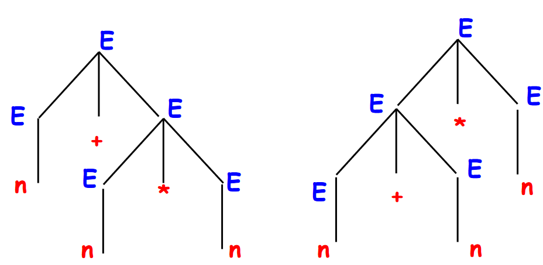

# 01-generative-grammars
## Componenti in modo informale
* **Vocabolario:** un insieme di simboli.
	* Alcuni dei quali chiamatai *terminali* costituiscono i token di output dell'*analisi lessicale*.
	  E.g dato il vocabolario `{S, a, b}` allora `a` e `b` sono i non terminali.
	* Viene scelto un simbolo non terminale dal vocabolario come *start symbol*.
	  E.g. preso il vocabolario precedente `S` è lo *start symbol*.
* **Produzioni:** un insieme di regole per di stringhe in altre stringhe.
  Dobbiamo rispettare delle regole, per esempio la stringa da rimpiazzare deve contenere almeno un non terminale.
  E. g. {S $\to$ aSb, S $\to$ ab} 
## Linguaggio
E' un insieme di parole composte da non terminali che possono essere generate partendo dallo *start symbol* applicando x volte e in y modi diversi le regole di derivazione.  
Ogni riscritttura viene detta *derivation step*.
### Esempio
Data la grammatrica {S $\to$ aSb, S $\to$ ab} possiamo compiere un paio di passi di derivazione.  
S $\implies$ aSb $\implies$ aabb ; con due passi abbiamo ottenuto una parole che appartiene al linguaggio.  
S $\implies$ aSb $\implies$ aaSbb $\implies$ aaabbb ; con tre passi abbiamo ottenuto una parola valida.  
Possiamo concludere che il linguaggio generato dalla grammatica ha la forma {a$^n$ b$^n$ | n>0 },
### Convenzioni sulla $\varepsilon$
Usiamo il carattere speciale $\varepsilon$ per denotare la parola vuota, ha le seguenti proprietà:
* $\varepsilon \equiv \varepsilon \varepsilon$
* $\varepsilon \equiv$b$^n$ per ogni terminale b
### Esempio
S $\to$ aAb
aA $\to$ aaAb
A $\to \varepsilon$ 

Il linguaggio generato è {a$^n$ b$^n$ | n>0 }, quindi grammatiche diverse possono generate linguaggi uguali.
### Esempio
S $\to$ AB  
A $\to$ aA  
A $\to$ a  
B $\to$ Bb  
B $\to$ b

S $\implies$ AB $\implies$ aAB $\implies$ aaB $\implies$ aab
Genera il linguaggio {a$^n$ b$^m$ | n,m>0}
### Esempio
S $\to$ AB  
A $\to$ a  

S $\implies$ AB $\implies$ aB
Quindi non arrivo mai ad una parola priva di non terminali per cui il lingiaggio generato è $\emptyset$
### Esempio
S $\to \varepsilon$ 

Viene generato il linguaggio {$\varepsilon$} che è $\neq \emptyset$
### Esempio
S $\to$ aSb   
S $\to \varepsilon$ 

Genera il linguaggio {a$^n$ b$^n$ | n>0} $\cup$ {$\varepsilon$} = {a$^n$ b$^n$ | n $\geq$ 0} 
## Componenti in modo formale
Una grammatica è una tupla (V, T, S, P)
* **V:** vocabolario con terminali e non.
* **T:** insieme dei terminali.
* **S:** simbolo di inizio che si trova in (V\\T).
* **P:** insieme delle produzioni.
## Notazione
* Maiuscole iniziali dell'alfabeto: A, B, $\dots \in$ (V\\T)
* Maiuscole finali dell'alfabeto: X, Y, $\dots \in$ V
* Minuscole iniziali dell'alfabeto: a,b, $\dots \in$ T
* Minuscole iniziali dell'alfabeto greco: $\alpha, \beta, \dots \in$ V* 
	  '\*' sta ad indicare che ci possono essere più ripetizioni degli elementi nell'insieme di partenza
* Stringhe di terminali: $w, w_{0}, \dots$
* **Produzioni:**  $\delta \to \beta$
	* $\delta \in$V$^+$, ovvero tutti i simboli del vocabolario esclusa $\varepsilon$
	* $\delta$ contiene almeno un non terminale
	* $\delta$ è chiamato **driver** della produzione
	* $\beta$ è chiamato **body** della produzione
* **Linguaggio generato:** L(G) = {$w | w \in T^*\ and\ S \implies w$}
	  Usiamo $T^*$ perchè la parola $w$ potrebbe essere solo $\varepsilon$ 
## Gerarchia delle grammatiche
Dipendono dalla forma delle produzioni.  
Passiamo ora a vedere alcuni tipi di grammatiche.
## Grammatiche context-free
Le grammatiche *context-free* o *free* hanno solo produzioni della forma:
$$A \to \beta$$
### Linguaggi context-free
*L* è un linguaggio *context-free* se e solo se esiste una grammatica *context-free* tale che:
$$L=L(G)$$
## Derivazioni
* **Rightmost/Leftmost:** rimpiazziamo il non terminale più a destra/sinistra indipendentemente dalle scelte precedenti.
* **Canoniche:** se inizio con derivazioni rightmost continuo con esse e viceversa per leftmost.
## Alberi di derivazione
I linguaggi liberi possono essere rappresentati come un albero tale che:
* Lo *start symbol* è la radice.
* Per ogni passo di derivazione si aggiunge un livello.
* La produzione $A \to X_1 X_2 \dots X_n$ genera i nodi figli $X_1 X_2 \dots X_n$ che partono dal nodo $A$.
* Le foglie sono i caratteri terminali, compresa $\varepsilon$.
* La parola generata è la concatenzaione delle foglie dell'albero.
## Ambiguità
Una grammatica *G* è ambigua se e solo se esiste una parola $w\in$L(G) che può essere generata da due derivazioni canoniche distinte, anche entrambe rightmost o leftmost.
### Esempio
E $\to$ E+E | E\*E | n ; è ambigua?
Prendiamo w=n+n\*n
  
Come si può vedere anche se abbiamo cambiato derivazioni canoniche la parola generata è la stessa.
### Osservazioni
L'ambiguità è indecidibile e non possono essere creati algoritmi in grado di capire se una grammatica è ambigua o meno.